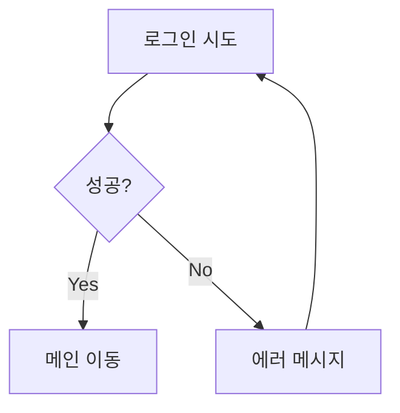
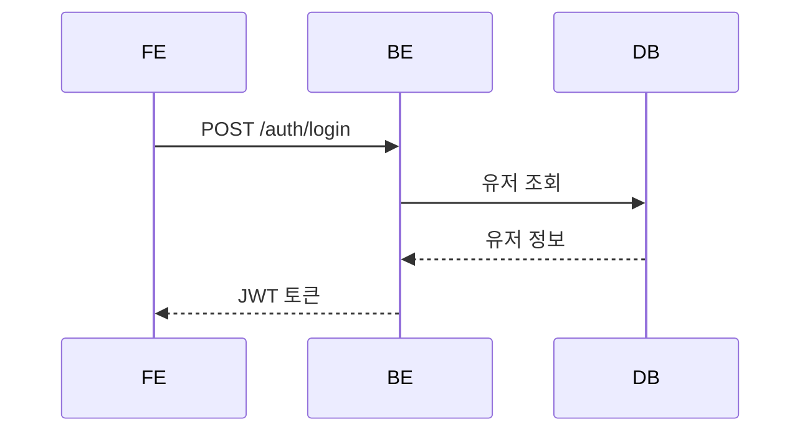
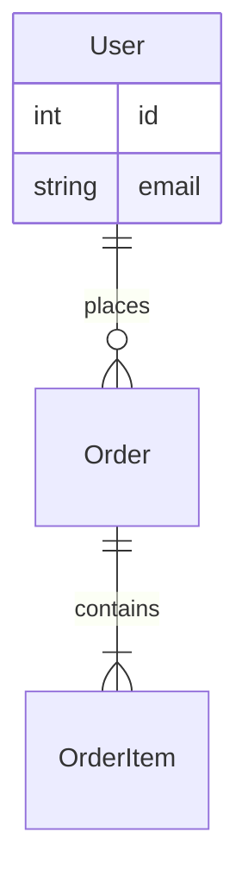
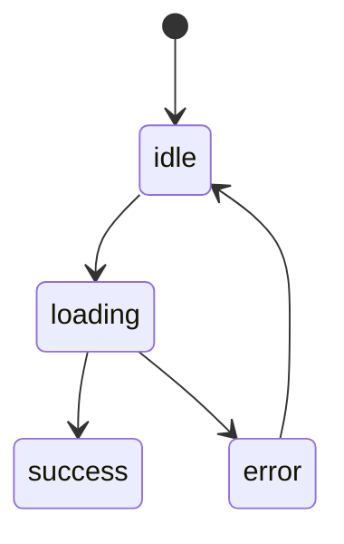

# Claude Code - 개발 자동화 에이전트 파이프라인

> 문서 작성부터 E2E 테스트까지 — Frontend · Backend · QA를 중심으로 한 개발 파트 자동화 설계

---

## 00 · Quick Start — 사용 방법

디자이너에게 퍼블리싱된 HTML을 받았다면, **프롬프트 한 줄**이면 파이프라인이 시작됩니다.

### STEP 1 · 디자이너에게 받은 것

**퍼블리싱된 HTML** — `디자인_비짓강남_메인_v1_C.html`

| 포함된 것 | 포함되지 않은 것 |
|---|---|
| 완성된 화면 레이아웃 · 컴포넌트 구조 | 실제 API 연동 · 비즈니스 로직 |
| CSS 스타일링 · 반응형 대응 | DB 스키마 · 백엔드 구현 |
| 인터랙션 동작 (hover, click 등) | 에러 처리 · 인증/인가 |

### STEP 2 · Claude Code에 입력하는 프롬프트

```
claude › 디자인_비짓강남_메인_v1_C.html을 분석해서 프로젝트에 구현해줘
```

> 이 한 줄로 아래 파이프라인 전체가 자동 실행됩니다

### STEP 3 · 파이프라인이 자동으로 하는 일

| 단계 | Agent | 설명 | 실행 |
|---|---|---|---|
| 01 | 문서 작성 Agent | HTML을 분석 → 화면명세서 · 기능명세서 · API명세 · Mermaid 다이어그램 자동 생성 | 자동 |
| ⏸️ | 사람 검토 | 생성된 문서 확인 · 부족한 부분 수정 · 승인 | **수동** |
| 02 | 이슈 생성 Agent | 승인된 문서 → GitHub 이슈 자동 생성 (FE · BE · QA 라벨 + 의존성 연결) | 자동 |
| 03+04 | FE + BE Agent 병렬 개발 | 이슈 의존성 기반으로 FE 컴포넌트 · BE API를 병렬 구현 → 완료 후 실제 연동 | 자동 |
| 05 | QA Agent | 문서에서 시나리오 도출 → Playwright E2E 테스트 → 실패 시 자동 수정 루프 | 자동 |
| 06+07 | 로그 문서화 Agent | 테스트 결과 자동 문서화 → 성공 시 Baseline 생성 · 실패 시 에러 리포트 | 자동 |

**결과** — 퍼블리싱 HTML → 실제 프로젝트 코드 (FE 컴포넌트 + BE API + DB 스키마 + E2E 테스트 + 문서) 완성. 사람은 중간에 문서 검토 한 번만 하면 됩니다.

---

## 01 · Overview — 전체 파이프라인

### Phase 1 · 문서화

**AGENT 01 — 문서 작성 Agent**

설계 자료와 인터랙션 명세를 바탕으로 개발 문서 작성. 코드 작성 전 로직을 Mermaid 다이어그램으로 도식화해 FE · BE · QA Agent의 공통 계약서 역할.

`화면명세서.md` `기능명세서.md` `API명세초안.md` `플로우차트` `시퀀스 다이어그램` `ER 다이어그램` `상태 다이어그램` `mermaid skill` `File System MCP`

#### EXAMPLE · 로그인 페이지를 설계한다면

| 화면명세서.md | 기능명세서.md |
|---|---|
| → 이메일/비밀번호 입력 필드 스펙 | → 로그인 시도 → 성공/실패 분기 로직 |
| → 소셜 로그인 버튼 배치 및 동작 | → JWT 토큰 저장 방식 (httpOnly Cookie) |
| → 유효성 검사 에러 메시지 위치/문구 | → 5회 실패 시 계정 잠금 정책 |
| → 반응형 브레이크포인트별 레이아웃 | → 자동 로그인 / 로그인 상태 유지 로직 |

| API명세초안.md | Mermaid 다이어그램 |
|---|---|
| → POST /auth/login — 요청/응답 JSON 구조 | → 플로우차트: 로그인 → 검증 → 성공/실패 흐름 |
| → POST /auth/refresh — 토큰 갱신 엔드포인트 | → 시퀀스: FE → BE → DB 통신 순서 |
| → 에러 코드 정의 (401, 403, 429) | → ER: User, Session, LoginAttempt 테이블 |
| → Rate Limit 정책 (분당 10회) | → 상태: idle → loading → success/error |

> **이 문서가 왜 중요한가?** — FE Agent는 화면명세서로 UI를 구현하고, BE Agent는 API명세로 엔드포인트를 구현하며, QA Agent는 기능명세서의 플로우차트로 E2E 테스트 시나리오를 생성합니다. 문서의 품질이 곧 전체 파이프라인의 품질을 결정합니다.

↓

### ⏸️ 사람 검토 포인트 (핵심)

문서 부족한 부분 직접 수정/보완 후 승인. 이 문서가 이후 모든 Agent의 기준이 됩니다.

↓

### Phase 2 · 이슈 생성

**AGENT 02 — 이슈 생성 Agent**

승인된 문서를 페이지 · 컴포넌트 · API 단위로 쪼개어 GitHub 이슈 자동 생성. 이슈가 FE · BE · QA Agent의 작업 단위가 됩니다.

`GitHub 이슈 생성` `FE / BE / QA 라벨` `Acceptance Criteria` `이슈 간 의존성 연결` `GitHub MCP`

#### EXAMPLE · 로그인 페이지 문서로부터 이슈가 생성되는 과정

> **분해 원칙** — 하나의 이슈 = 하나의 PR이 될 수 있는 단위로 쪼갭니다. FE는 컴포넌트/페이지 단위, BE는 엔드포인트 단위, QA는 시나리오 단위로 분리합니다.

**[FE] Frontend 이슈 3건**
- `#12` LoginForm 컴포넌트 구현 — 이메일/비밀번호 입력, 유효성 검사, 에러 표시
- `#13` SocialLoginButtons 컴포넌트 구현 — Google, Kakao OAuth 버튼
- `#14` /login 페이지 조립 및 API 연동 — 토큰 저장, 리다이렉트 처리

**[BE] Backend 이슈 3건**
- `#15` POST /auth/login 엔드포인트 구현 — 인증 로직, JWT 발급
- `#16` POST /auth/refresh 엔드포인트 구현 — 토큰 갱신
- `#17` User, Session, LoginAttempt DB 스키마 생성

**[QA] QA 이슈 1건**
- `#18` 로그인 페이지 E2E 테스트 — 정상 로그인, 실패 케이스, 소셜 로그인, 계정 잠금 시나리오

**이슈 간 의존성 자동 연결**
- `#14` /login 페이지 조립 → **blocked by** `#12` `#13` (컴포넌트 먼저)
- `#18` QA E2E 테스트 → **blocked by** `#14` `#15` `#16` `#17` (FE+BE 완료 후)

**이슈에 포함되는 Acceptance Criteria 예시 (#12)**
- ☐ 이메일 형식 유효성 검사 → 실패 시 인라인 에러 표시
- ☐ 비밀번호 8자 이상, 특수문자 포함 검증
- ☐ 로딩 중 버튼 disabled + 스피너 표시
- ☐ API 에러 시 토스트 메시지로 사용자 알림

↓

### Phase 3 · 개발 (병렬 Agent Team)

**AGENT 03 · FE Team — Frontend Agent**

API 명세를 계약서로 삼아 컴포넌트 및 페이지 UI 구현. Backend 완료 신호가 오면 실제 API 연동.

`컴포넌트 구현` `API 호출 코드` `PR 생성` `nextjs-frontend-guidelines` `File System MCP` `GitHub MCP`

**AGENT 04 · BE Team — Backend Agent**

동일한 API 명세 기준으로 엔드포인트 구현 및 DB 스키마 설계. 완료 시 Orchestrator에게 신호 전달.

`API 구현` `DB 스키마` `PR 생성` `fastapi-backend-guidelines` `File System MCP` `GitHub MCP`

#### 이슈 의존성 기반 병렬 처리 플로우

> **핵심 원칙** — Orchestrator가 이슈의 **blocked by** 관계를 읽고, 의존성이 없는 이슈들을 FE/BE Agent에게 동시 할당합니다. 선행 이슈가 완료되면 다음 이슈가 자동으로 큐에 올라갑니다.

**실행 타임라인 예시 — 로그인 페이지**

**`WAVE 1`** 의존성 없는 이슈 — 동시 시작

| FE | BE |
|---|---|
| `[FE]` #12 LoginForm 컴포넌트 | `[BE]` #17 DB 스키마 생성 |
| `[FE]` #13 SocialLoginButtons | `[BE]` #15 POST /auth/login |

↓ 완료된 이슈의 의존성 해제

**`WAVE 2`** 선행 이슈 완료 → 다음 이슈 자동 시작

| FE | BE |
|---|---|
| `[FE]` #14 /login 페이지 조립 | `[BE]` #16 POST /auth/refresh |
| ← #12, #13 완료 후 unblock | ← #17 DB 스키마 완료 후 unblock |

↓ FE + BE 모든 이슈 완료

**`WAVE 3`** FE ↔ BE 실제 API 연동

`[FE+BE]` Mock 제거 → 실제 API 연동 → 통합 테스트 → PR 생성
← FE #14 + BE #15, #16, #17 모두 완료 후

**Orchestrator의 이슈 스케줄링**

1. 이슈 목록에서 `blocked by = 없음`인 이슈 수집
2. FE 이슈 → Agent 03에 할당, BE 이슈 → Agent 04에 할당
3. 각 Agent는 할당된 이슈를 병렬로 동시 처리
4. 이슈 완료 → GitHub 이슈 close + PR 생성
5. 의존성 해제된 다음 이슈를 자동으로 큐에 추가
6. FE+BE 모두 완료 시 → 연동 단계 진입

↓

### Phase 4 · 검증

**AGENT 05 — QA Agent (E2E 테스트)**

기능명세서 · 플로우차트 · 상태 다이어그램 · API명세를 읽고 테스트 시나리오를 자동 도출한 뒤 Playwright로 E2E 실행. CDP로 API 응답, JS 에러, 스크린샷 실시간 수집. 실패 시 FE/BE 원인 판단 후 Orchestrator 리포트.

`Playwright` `시나리오 기반 테스트` `FE / BE 원인 판단` `CDP MCP` `File System MCP`

#### EXAMPLE · 로그인 페이지 E2E 테스트 실행 과정

**`STEP 1`** Agent가 문서를 읽고 테스트 시나리오 도출

> **Agent가 읽는 문서** — 기능명세서.md (비즈니스 로직, 예외 정책) + 플로우차트 (분기 경로) + 상태 다이어그램 (UI 상태 전이) + API명세초안.md (요청/응답 구조, 에러 코드)

```
// Agent가 플로우차트의 분기를 순회하며 경로 추출

flowchart TD
  A[로그인 시도] --> B{입력 유효?}
  B -->|Yes| C[POST /auth/login]
  B -->|No| D[유효성 에러 표시]        → TC-08
  C --> E{인증 성공?}
  E -->|200| F[메인 이동]              → TC-01
  E -->|401| G[에러 메시지]            → TC-05, TC-06
  E -->|429| H[계정 잠금 안내]          → TC-07
  G --> I{5회 초과?}
  I -->|Yes| H

// + 기능명세서에서 OAuth, 자동로그인 로직 → TC-02, TC-03, TC-04 도출
```

| Happy Path — 정상 경로에서 도출 | Edge / Error — 분기 경로에서 도출 |
|---|---|
| TC-01 정상 이메일/비밀번호 로그인 ← 플로우 A→B→C→E→F | TC-05 잘못된 비밀번호 → 에러 ← 플로우 E→G (401) |
| TC-02 Google OAuth 로그인 ← 기능명세서 OAuth 항목 | TC-06 존재하지 않는 이메일 → 에러 ← 플로우 E→G (401) |
| TC-03 Kakao OAuth 로그인 ← 기능명세서 OAuth 항목 | TC-07 5회 실패 → 계정 잠금 ← 플로우 I→H (429) |
| TC-04 자동 로그인 유지 확인 ← 기능명세서 세션 정책 | TC-08 빈 폼 제출 → 유효성 에러 ← 플로우 B→D |

**`STEP 2`** Playwright 실행 + CDP 실시간 수집

```javascript
// TC-01 정상 로그인 시나리오
await page.goto('/login')
await page.fill('#email', 'user@test.com')
await page.fill('#password', 'Pass1234!')
await page.click('button[type=submit]')

// CDP가 동시에 수집하는 것들
Network → POST /auth/login 200 142ms
Console → 에러 없음
Page    → 스크린샷 캡처 (로그인 전/후)

await expect(page).toHaveURL('/dashboard')  ✓ PASS
```

**`STEP 3`** 실패 시 — CDP 데이터 기반 FE/BE 원인 자동 판단

| → FE 원인으로 판단 | → BE 원인으로 판단 |
|---|---|
| API 응답 `200 OK` 정상 수신 | API 응답 `500` 서버 에러 |
| but UI에 데이터 미반영 | or 응답 JSON 구조 명세와 불일치 |
| or Console에 `TypeError` 발생 | or 응답 시간 > 3초 타임아웃 |
| or DOM에 기대 요소 없음 | or `401/403` 인증 오류 |
| → Agent 03 (FE) 재실행 요청 | → Agent 04 (BE) 재실행 요청 |

**Orchestrator에게 전달되는 QA 리포트**

```
page:       /login
total:      8 scenarios
passed:     6    failed: 2
failures:
  TC-05 → BE · POST /auth/login 500 · 에러 응답 body 없음
  TC-07 → FE · 계정 잠금 안내 UI 미표시 · API 429 정상 수신
artifacts:   screenshots/ network-logs/ console-logs/
```

↓

### Phase 5 · 로그 문서화 (QA 결과에 따라 분기)

#### AGENT 06 · QA 실패 시 — 에러 문서화 Agent

QA 리포트의 실패 항목과 CDP 수집 데이터(스크린샷, Network 로그, Console 에러)를 결합해 구조화된 에러 문서 자동 생성. 동일 에러 반복 시 패턴을 감지하고 에스컬레이션.

`에러 리포트` `패턴 감지` `3회 → 에스컬레이션` `CDP MCP` `File System MCP`

**EXAMPLE · TC-05 실패 → 에러 문서 생성 과정**

```markdown
# docs/errors/2026-02-19_TC-05_login-500.md

# 에러 리포트
시나리오:   TC-05 잘못된 비밀번호 → 에러 메시지
원인 판단:  BE · POST /auth/login 500
반복 횟수:  2회차 (1회차: 2026-02-19 14:30)

## CDP 수집 데이터
Network   POST /auth/login → 500 89ms
          Response: {"detail":"Internal Server Error"}
Console   Unhandled Exception: KeyError 'hashed_pw'
Screenshot  

## 이전 시도 이력
  1회차: Agent 04가 login 엔드포인트 수정 → 동일 에러 재발

## 다음 액션
  → Agent 04 (BE) 재실행 요청 + 에러 컨텍스트 전달
```

| 반복 패턴 감지 | 3회 이상 → 사람 에스컬레이션 |
|---|---|
| Agent가 이전 에러 문서를 조회해서 | 1~3회차 에러 문서 통합 요약 생성 |
| 동일 시나리오 · 동일 원인의 반복 횟수 추적 | 각 시도에서 Agent가 수정한 내용 정리 |
| **1~2회** → 에러 컨텍스트와 함께 재실행 요청 | 추정 원인 및 해결 불가 사유 명시 |
| **3회 이상** → 자동 수정 불가 판단 | 파이프라인 일시 정지 + 사람 판단 대기 |

#### AGENT 07 · QA 성공 시 — 성공 로그 문서화 Agent

전체 통과된 시나리오의 CDP 수집 데이터(스크린샷, API 응답 시간, 상태코드)를 시나리오별로 정리해 문서화. 이후 회귀 테스트의 기준선(Baseline)으로 활용.

`스크린샷 자동 캡처` `시나리오별 리포트` `Baseline 생성` `CDP MCP` `File System MCP`

**EXAMPLE · 전체 통과 → 성공 로그 문서 생성**

```
docs/qa-logs/2026-02-19_login/
├─ summary.md              ← 전체 결과 요약
├─ TC-01_normal-login.md
├─ TC-02_google-oauth.md
├─ ...
├─ screenshots/
│   ├─ TC-01_before.png
│   ├─ TC-01_after.png
│   └─ ...
└─ baseline.json           ← 회귀 테스트 기준선
```

```markdown
# TC-01_normal-login.md

시나리오:   정상 이메일/비밀번호 로그인
결과:      PASS

## API 성능 기록
  POST /auth/login → 200  142ms
  GET  /user/me    → 200  38ms

## 스크린샷
  로그인 폼 초기 상태  → TC-01_before.png
  대시보드 리다이렉트 → TC-01_after.png
```

| baseline.json — 기준선 데이터 | 회귀 테스트 시 활용 방식 |
|---|---|
| 시나리오별 API 응답 시간 기준값 | 다음 파이프라인의 Agent 05가 참조 |
| 예상 상태코드 및 응답 구조 | 응답 시간 20% 이상 증가 → 경고 플래그 |
| 스크린샷 해시 (시각적 변경 감지용) | 스크린샷 diff → 의도하지 않은 UI 변경 감지 |
| 다음 배포 시 회귀 테스트 비교 기준 | API 응답 구조 변경 → 명세 불일치 감지 |

↓

### 최종 결과

| QA 실패 시 | QA 성공 시 |
|---|---|
| 🔄 해당 Agent 재실행 | ✅ 배포 준비 완료 |
| Orchestrator가 FE/BE 판단 후 해당 Agent에게 재할당 | 다음 페이지 파이프라인 시작 |

---

## 02 · Agent Details — Agent별 입출력 정의

| Agent | 입력 | 출력 |
|---|---|---|
| **01 · 문서 작성** | 화면 설계 자료 + 인터랙션 명세 문서 (+ Notion 기획서 선택적) | 화면명세서.md / 기능명세서.md / API명세초안.md / Mermaid 다이어그램 (+ docs/input-visualization/ 선택적) |
| **02 · 이슈 생성** | 승인된 docs/ 폴더 + GitHub Repo 정보 | GitHub 이슈 (FE/BE/QA 라벨), Acceptance Criteria, 이슈 간 의존성 |
| **03 · Frontend** | FE 이슈 + 화면명세서 + API명세 + Mermaid | 컴포넌트 코드 + 페이지 코드 + PR |
| **04 · Backend** | BE 이슈 + API명세 + 기능명세서 + ER 다이어그램 | API 엔드포인트 + DB 스키마 + PR |
| **05 · QA** | QA 이슈 + 기능명세서 + 플로우차트 + FE/BE URL | E2E 테스트 코드 + 구조화된 결과 리포트 |
| **06 · 에러 문서화** | QA 실패 리포트 + CDP 수집 데이터 | docs/errors/{날짜}\_{시나리오}.md + Notion PIPELINE_LOG 페이지 + error-viz.html |
| **07 · 성공 로그** | QA 전체 통과 신호 + CDP 수집 데이터 | docs/qa-logs/{날짜}\_{페이지}/ 폴더 + Notion PIPELINE_LOG 페이지 + success-viz.html |

---

## 03 · Mermaid 도식화 — 코드 작성 전 로직 시각화

Agent 01이 문서 작성 시 Mermaid 다이어그램을 함께 생성. FE · BE · QA Agent가 이 다이어그램을 공통 계약서로 사용합니다.

### 플로우차트 — 사용자 시나리오



- Agent 05 QA: E2E 테스트 시나리오 기준
- 예외 케이스 (실패, 재시도) 명확히 정의

### 시퀀스 다이어그램 — FE ↔ BE 통신



- Agent 03 FE: API 호출 코드 작성 기준
- Agent 04 BE: 엔드포인트 응답 형식 기준

### ER 다이어그램 — DB 스키마



- Agent 04 BE: SQLModel 스키마 설계 기준
- 테이블 관계 및 필드 타입 명확히 정의

### 상태 다이어그램 — 컴포넌트 상태



- Agent 03 FE: 로딩/에러/성공 상태 UI 구현 기준
- Agent 05 QA: 각 상태별 테스트 시나리오 추가

---

## 04 · Orchestrator — 실패 시 재진입 판단 로직

> **Orchestrator의 역할** — QA 리포트를 수신하면 결과에 따라 다음 액션을 결정합니다. 실패 시 원인(FE/BE)과 영향 범위(해당 이슈/API 명세/문서 전체)를 판단해 최소 범위만 재실행합니다.

### 분기 플로우

| 트리거 | → | 액션 |
|---|---|---|
| QA 전체 통과 | → | **Agent 07 실행** → 성공 로그/스크린샷 문서화 → 배포 준비 완료 |
| QA 실패 (FE) | → | API 200이지만 UI 미반영 → **Agent 06 실행** → **Agent 03 재실행** |
| QA 실패 (BE) | → | API 500 에러 또는 응답 구조 불일치 → **Agent 06 실행** → **Agent 04 재실행** |
| QA 실패 (FE+BE) | → | FE · BE 원인 복합 → **Agent 06 실행** → **Agent 03 & 04 동시 재실행** |
| API 명세 변경 | → | 사람이 명세 수정 → **Agent 03 & 04 동시 재실행** → Agent 05 재검증 |
| 문서 내용 변경 | → | 사람이 기능명세 수정 → **Agent 02부터** 재실행 (이슈 재생성 → 개발 → QA) |
| 3회 이상 반복 | → | 자동 수정 불가 판단 → **⏸️ 사람에게 에스컬레이션** → 파이프라인 일시 정지 |

### EXAMPLE · TC-05 실패 → 재진입 → 재검증 전체 흐름

**① 1회차 — QA 실패 감지**
- Agent 05 → Orchestrator: TC-05 FAIL · `BE` · POST /auth/login 500
- Orchestrator 판단: 원인: BE · 반복: 1회차 → Agent 06 → Agent 04 재실행

→ Agent 06 실행: 에러 문서 생성 · CDP 데이터 첨부 · 반복 1회차 기록
→ Agent 04 (BE) 재실행: 에러 문서 + QA 리포트를 컨텍스트로 전달받아 수정

**② 2회차 — 재검증 (Agent 05 자동 재실행)**
- Agent 05 재실행 결과: TC-05 다시 FAIL · 동일 원인 · POST /auth/login 500
- Orchestrator 판단: 원인: BE · 반복: 2회차 → Agent 06 업데이트 → Agent 04 재실행

→ Agent 06 실행: 에러 문서에 2회차 이력 추가 · 이전 수정 사항과 비교 분석
→ Agent 04 (BE) 재실행: 1~2회차 에러 문서 전체를 컨텍스트로 전달 · 다른 접근 시도

**③ 3회차 — 재검증 실패 → 에스컬레이션**
- Agent 05 재실행 결과: TC-05 여전히 FAIL · 3회 반복 감지
- Orchestrator 판단: 자동 수정 불가 → 파이프라인 일시 정지 → 사람에게 에스컬레이션

```
⏸️ ESCALATION REPORT

시나리오:   TC-05 잘못된 비밀번호 → 에러 메시지
반복:      3회 실패 · 자동 수정 불가
원인:      BE · POST /auth/login 500

## 시도 이력
  1회 Agent 04 수정: login_service.py 패스워드 비교 로직 수정
  2회 Agent 04 수정: User 모델 hashed_pw 필드 타입 변경
  3회 Agent 04 수정: bcrypt 의존성 버전 업데이트

## Agent 추정 원인
  bcrypt 라이브러리와 Python 3.12 호환 이슈 가능성

첨부:      errors/TC-05_round1.md  errors/TC-05_round2.md  errors/TC-05_round3.md
```

### 재진입 범위 판단 기준

| 최소 범위 — 단일 Agent | 중간 범위 — Phase 3부터 | 최대 범위 — Phase 2부터 |
|---|---|---|
| QA 실패 원인이 FE 또는 BE 한쪽 | API 명세 자체가 변경된 경우 | 기능명세서 또는 화면명세서 수정 시 |
| 해당 Agent만 재실행 | FE + BE 모두 재실행 필요 | 이슈 자체가 바뀌므로 재생성 필요 |
| 에러 문서를 컨텍스트로 전달 | Agent 03 & 04 동시 재실행 | Agent 02 → 03 & 04 → 05 순서 |
| 수정 후 Agent 05 재검증 | 연동 후 Agent 05 재검증 | 전체 파이프라인 재실행 |

---

## 05 · Feature Change — 기능 변경 시 파이프라인 재진입

> **핵심 원칙** — 기능 변경은 QA 실패와 다릅니다. QA 실패는 "구현이 명세와 다른 것"이고, 기능 변경은 "명세 자체가 바뀌는 것"입니다. Orchestrator는 변경의 범위를 판단해 최소한의 Phase부터 재실행합니다.

### TYPE 1 — 기존 기능의 일부 수정

로직이나 정책 값만 바뀌고, 기능의 구조 자체는 유지되는 경우

> **EXAMPLE** — 로그인 실패 시 계정 잠금 정책: ~~5회 실패 → 잠금~~ → **3회 실패 → 잠금**으로 변경

**재진입 플로우:**
`사람이 문서 수정` → `Agent 02 영향받는 이슈만 업데이트` → `해당 Agent만 재실행` → `Agent 05 재검증`

- **영향 범위:** 기능명세서 정책 값 수정 → BE 이슈 #17 Acceptance Criteria 변경 → Agent 04만 재실행 → QA TC-07만 재검증
- **유지되는 것:** 기존 이슈 구조, FE 코드, API 명세, 다른 TC 결과 (Baseline 활용)

### TYPE 2 — 기존 기능에 새 요구사항 추가

기존 기능은 유지한 채 새로운 기능이 추가되는 경우

> **EXAMPLE** — 기존 이메일/비밀번호 로그인에 **2FA (이메일 인증코드)** 기능 추가

**재진입 플로우:**
`Agent 01 문서 보완` → `⏸️ 사람 검토` → `Agent 02 새 이슈 추가` → `03 & 04 새 이슈만 개발` → `Agent 05 전체 QA`

- **영향 범위:** 기능명세서에 2FA 항목 추가 → API명세에 POST /auth/verify-code 추가 → 새 FE/BE 이슈 생성 → 새 이슈만 개발
- **유지되는 것:** 기존 이슈 · 기존 코드 · 기존 PR (그대로 유지)
- **주의:** QA는 기존 시나리오 + 새 시나리오 전체 실행 (기존 기능 회귀 방지)

### TYPE 3 — 기능 전체 재설계

기존 기능의 근본적인 방식이 바뀌어 이전 구현을 대부분 폐기해야 하는 경우

> **EXAMPLE** — 로그인 방식을 ~~이메일/비밀번호~~ → **전화번호 + OTP 기반**으로 전면 전환

**재진입 플로우:**
`Agent 01 문서 전면 재작성` → `⏸️ 사람 검토` → `Agent 02 기존 이슈 close + 새 이슈` → `03 & 04 전면 재개발` → `Agent 05 전체 QA`

- **영향 범위:** 화면명세서 · 기능명세서 · API명세 전면 재작성 → 기존 이슈 전체 close → 새 이슈 생성 → 전면 재개발
- **폐기되는 것:** 기존 FE/BE 코드, 이전 PR, 이전 QA Baseline
- **주의:** 이전 Baseline은 아카이브 처리 (삭제하지 않음). 새 Baseline으로 대체

### Orchestrator 변경 유형 판단 기준

사람이 문서를 수정하면 Orchestrator가 **변경된 문서의 diff**를 분석해서 어떤 TYPE인지 자동 판단합니다.

| TYPE 1 판단 조건 | TYPE 2 판단 조건 | TYPE 3 판단 조건 |
|---|---|---|
| 변경된 파일: 1~2개 | 변경 내용: 새 항목 추가 (삭제 없음) | 변경된 파일: 전체 문서 |
| 변경 내용: 숫자 값, 문구, 정책 | API 엔드포인트: 신규 추가 | API 엔드포인트: 대부분 삭제/변경 |
| API 엔드포인트: 변경 없음 | 기존 플로우차트: 분기 추가 | 플로우차트: 전면 재작성 |
| ER 다이어그램: 변경 없음 | 기존 ER: 테이블/필드 추가 | ER 다이어그램: 구조 변경 |

### QA 실패 재진입 vs 기능 변경 재진입 — 차이점

| | QA 실패 재진입 | 기능 변경 재진입 |
|---|---|---|
| **트리거** | Agent 05 리포트 (자동) | 사람의 문서 수정 (수동) |
| **문서** | 변경 없음 (명세가 기준) | 변경됨 (새 기준 생성) |
| **이슈** | 변경 없음 (동일 이슈 재작업) | 변경/추가/폐기 가능 |
| **목표** | 코드를 명세에 맞추기 | 명세 자체를 새로 반영 |

---

## 06 · MCP 구성 — Agent별 MCP 사용

| Agent | 사용 MCP |
|---|---|
| 01 · 문서 작성 | `File System MCP` `Notion MCP` (선택적) |
| 02 · 이슈 생성 | `GitHub MCP` |
| 03 · Frontend | `File System MCP` `GitHub MCP` |
| 04 · Backend | `File System MCP` `GitHub MCP` |
| 05 · QA | `CDP MCP` `File System MCP` |
| 06 · 에러 문서화 | `CDP MCP` `File System MCP` `Notion MCP` (선택적) |
| 07 · 성공 로그 | `CDP MCP` `File System MCP` `Notion MCP` (선택적) |

### CDP (Chrome DevTools Protocol) 활용 포인트

- `Network.enable` → API 요청/응답 실시간 캡처 (Agent 05, 06, 07)
- `Console.enable` → JS 에러 로그 자동 수집 (Agent 05, 06)
- `Page.screenshot` → 성공/실패 시점 화면 자동 캡처 (Agent 06, 07)
- `DOM.getDocument` → 특정 시점 DOM 상태 캡처 (Agent 05)
- `Runtime.evaluate` → 브라우저에서 직접 JS 실행 (Agent 05)

---

## 07 · Claude Code 구조 — 파일 구조

```
project/
  CLAUDE.md              ← Orchestrator 전체 흐름 정의
  .claude/
    agents/
      01_doc_writer.md
      02_issue_creator.md
      03_frontend.md
      04_backend.md
      05_qa.md
      06_error_documenter.md
      07_success_logger.md
    skills/               ← 공통 규칙 모음
      doc_format.md
      code_convention.md
      api_naming.md
  docs/                   ← Agent가 생성하는 문서
    화면명세서.md
    기능명세서.md
    API명세초안.md
    errors/               ← Agent 06 에러 문서화 결과물
    qa-logs/              ← Agent 07 성공 로그 결과물 (Baseline)
```

---

## 08 · advanced-harness 통합 — 재사용할 Skills & Agents

[jaerinjaerin/advanced-harness](https://github.com/jaerinjaerin/advanced-harness) 레포에서 파이프라인에 바로 활용 가능한 스킬과 에이전트

### Skills 매핑

| Agent | Skill | 설명 |
|---|---|---|
| 01 · 문서 작성 | `mermaid` | 플로우차트, 시퀀스, ER, 상태 다이어그램 자동 생성 |
| 03 · Frontend | `nextjs-frontend-guidelines` | Next.js 15 App Router, shadcn/ui, Tailwind CSS 4 코드 생성 가이드 |
| | `frontend-design` | 프로덕션급 UI 품질 보장 가이드 |
| | `web-design-guidelines` | 접근성/UX 기준 코드 리뷰 자동 적용 |
| | `vercel-react-best-practices` | React/Next.js 성능 최적화 패턴 자동 적용 |
| | `error-tracking` | Sentry v8 FE 에러 트래킹 코드 자동 통합 |
| 04 · Backend | `fastapi-backend-guidelines` | FastAPI DDD 패턴, SQLModel ORM, async/await 가이드 |
| | `pytest-backend-testing` | 유닛/통합/비동기 테스트 자동 작성 가이드 |
| | `error-tracking` | Sentry v8 BE 에러 모니터링 통합 |
| 06 · 에러 문서화 | `mermaid` | 에러 발생 흐름을 플로우차트로 시각화 |
| 07 · 성공 로그 | `error-tracking` | 성공 케이스 성능 지표를 Sentry로 모니터링 및 추적 |

### Agents 매핑

| Agent | Agent (harness) | 설명 |
|---|---|---|
| Orchestrator | `planner` | 페이지별 구조화된 개발 계획을 dev/active/에 자동 생성 |
| | `plan-reviewer` | 각 Agent 실행 전 계획 리뷰 및 리스크 평가 |
| 01 · 문서 작성 | `documentation-architect` | API 문서, 데이터 플로우 다이어그램 자동 생성 |
| 03 · Frontend | `frontend-error-fixer` | 빌드타임/런타임 FE 에러 자동 감지 및 수정 (CDP 활용) |
| | `auto-error-resolver` | TypeScript 컴파일 에러 자동 감지 및 수정 |
| 04 · Backend | `auto-error-resolver` | TypeScript/Python 컴파일 에러 자동 수정 |
| | `code-architecture-reviewer` | PR 전 코드 품질, 아키텍처 일관성 자동 리뷰 |
| 05 · QA | `auth-route-tester` | 인증된 API 라우트 테스트, DB 변경 검증 |
| | `auth-route-debugger` | 401/403, JWT, 쿠키 관련 인증 이슈 자동 디버깅 |
| 06 · 에러 문서화 | `web-research-specialist` | 반복 에러 발생 시 GitHub Issues, Stack Overflow에서 해결책 리서치 |

---

## 09 · Notion 통합 — PIPELINE_LOG 연동

### PIPELINE_LOG 페이지 구조

```
PIPELINE_LOG (Page ID: 30db717d-4315-8099-b939-e6a70d60d428)
└── [DB] Pipeline Runs (인라인 데이터베이스, 1회 수동 생성)
      └── [row] 2026-02-20 shopping-mall login — PASSED
            └── child page: 상세 QA 결과, 시각화 결과 포함
```

### Pipeline Runs DB 속성 스키마

| 속성 | 타입 | 용도 |
|---|---|---|
| Name | title | `{날짜} {프로젝트} {페이지} — {결과}` |
| Project | select | 프로젝트명 |
| Phase | select | Phase 1–5 |
| Status | select | Running / Passed / Failed / Escalated |
| Run Date | date | 실행일 |
| Duration | number | 소요 시간(분) |
| TC Total | number | 전체 테스트 시나리오 수 |
| TC Passed | number | 통과 수 |
| TC Failed | number | 실패 수 |
| Failure Round | number | 재시도 횟수 |
| Root Cause | select | FE / BE / FE+BE / None |
| Escalated | checkbox | 3회 이상 실패 시 true |
| Notes | rich_text | 요약 메모 |

### 3가지 통합 모드

| Mode | 트리거 | Agent | 설명 |
|---|---|---|---|
| **A** | Notion URL/ID 입력 | Agent 01 | 기획서를 마인드맵/플로우차트로 시각화하여 문서 작성 참고 |
| **B** | QA 완료 후 자동 | Agent 06/07 | QA 결과를 Notion에 기록 + 시각화 보고서 생성 |
| **C** | `/pipeline-dashboard` | 온디맨드 | Pipeline Runs DB 전체 이력을 종합 대시보드로 생성 |

### Graceful Degradation

```
Notion MCP 미연결 시:
  → 경고 출력 후 로컬 docs/ 기록으로 진행
  → 파이프라인 절대 중단 금지

Pipeline Runs DB ID 미설정 시:
  → 안내 메시지 출력 후 로컬 전용 모드
  → PIPELINE_LOG 하위 페이지 생성은 가능, DB 행 추가만 건너뜀
```

### Notion 쓰기 MCP 도구 매핑

| 작업 | MCP 도구 ID |
|---|---|
| 페이지 생성 | `mcp__notion__API-post-page` |
| 블록 추가 | `mcp__notion__API-patch-block-children` |
| 페이지 조회 | `mcp__notion__API-retrieve-a-page` |
| DB 조회 | `mcp__notion__API-query-data-source` |
| 페이지 수정 | `mcp__notion__API-patch-page` |
| 검색 | `mcp__notion__API-post-search` |
