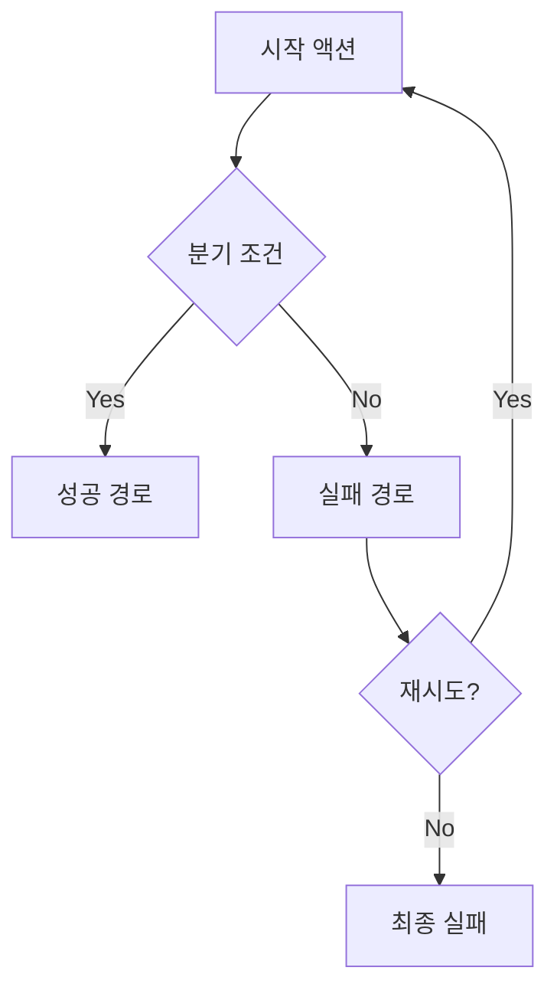
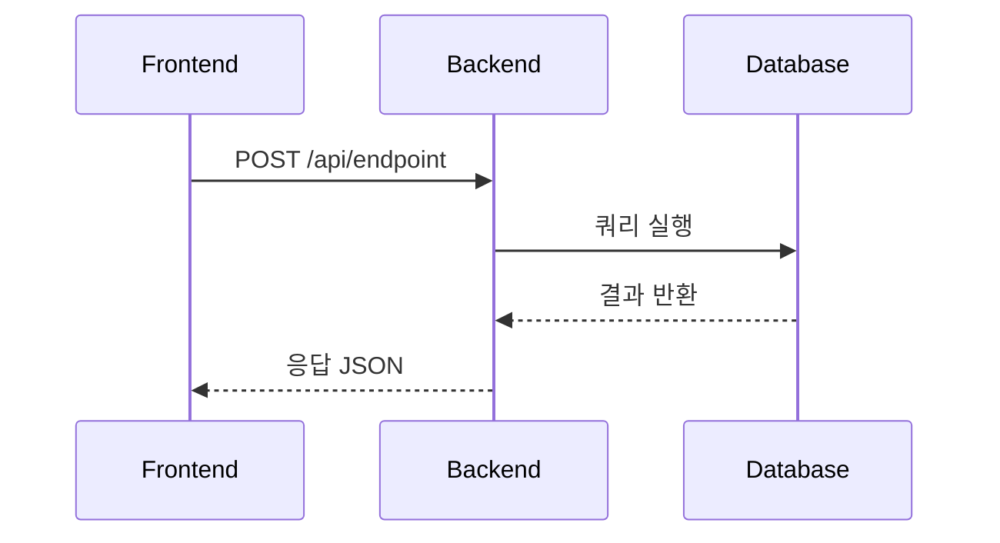
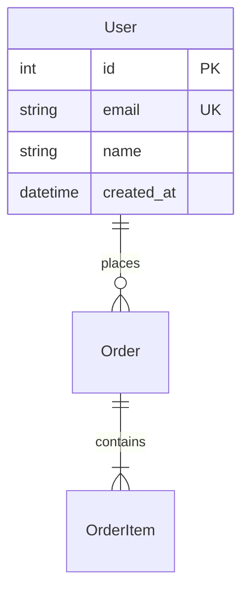
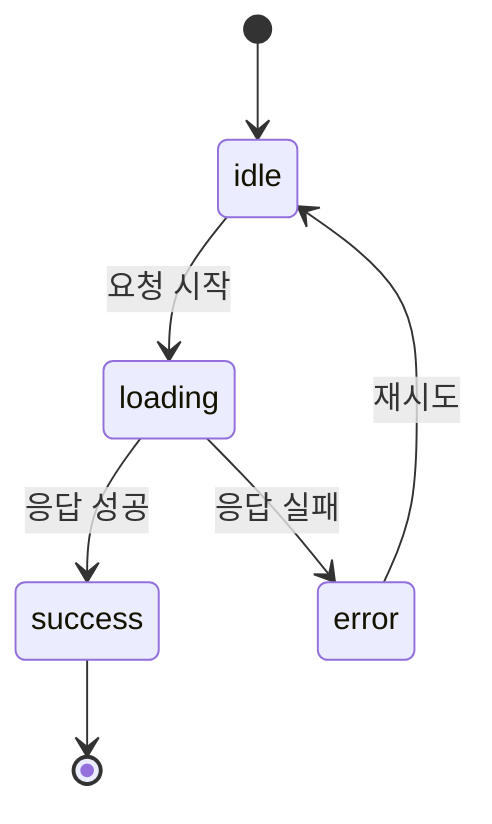

# Skill: Mermaid 다이어그램 (mermaid)

## 적용 대상

Agent 01 (문서 작성)이 문서 내 다이어그램 생성 시 사용.
Agent 06 (에러 문서화)이 에러 발생 흐름 시각화 시 사용.

## 다이어그램 유형별 용도

| 유형 | 참조 Agent | 용도 |
|---|---|---|
| 플로우차트 (flowchart) | Agent 05 QA | E2E 테스트 시나리오 도출 기준 |
| 시퀀스 (sequenceDiagram) | Agent 03 FE, Agent 04 BE | API 통신 순서 계약서 |
| ER (erDiagram) | Agent 04 BE | DB 스키마 설계 기준 |
| 상태 (stateDiagram-v2) | Agent 03 FE, Agent 05 QA | UI 상태 전이 및 테스트 기준 |

## 작성 규칙

### 플로우차트



- 모든 분기(성공/실패/예외)를 명시
- 각 분기 끝에 Agent 05가 도출할 TC 번호 주석
- 재시도/루프 경로 포함

### 시퀀스 다이어그램



- participant 명칭: FE, BE, DB (통일)
- 요청: `->>` (실선), 응답: `-->>` (점선)
- HTTP 메서드와 경로를 메시지에 포함
- 에러 응답도 별도 경로로 표시

### ER 다이어그램



- 필드 타입 명시 (int, string, datetime, boolean 등)
- PK, FK, UK 제약 조건 표기
- 관계: `||--o{` (1:N), `||--|{` (1:N 필수), `||--||` (1:1)

### 상태 다이어그램



- 초기 상태: `[*] --> {상태}`
- 전이 조건을 레이블로 표시
- 모든 종료 경로를 `[*]`로 연결
- UI 컴포넌트의 모든 가능한 상태 포함

## 주의사항

- Mermaid 코드 블록은 반드시 ` ```mermaid ` 으로 시작
- 노드 이름에 특수문자 사용 금지 (한글은 허용)
- 복잡한 다이어그램은 서브그래프(subgraph)로 분리
