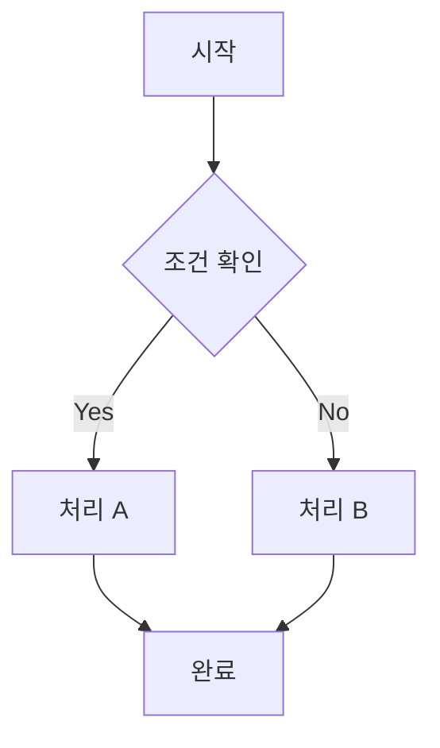
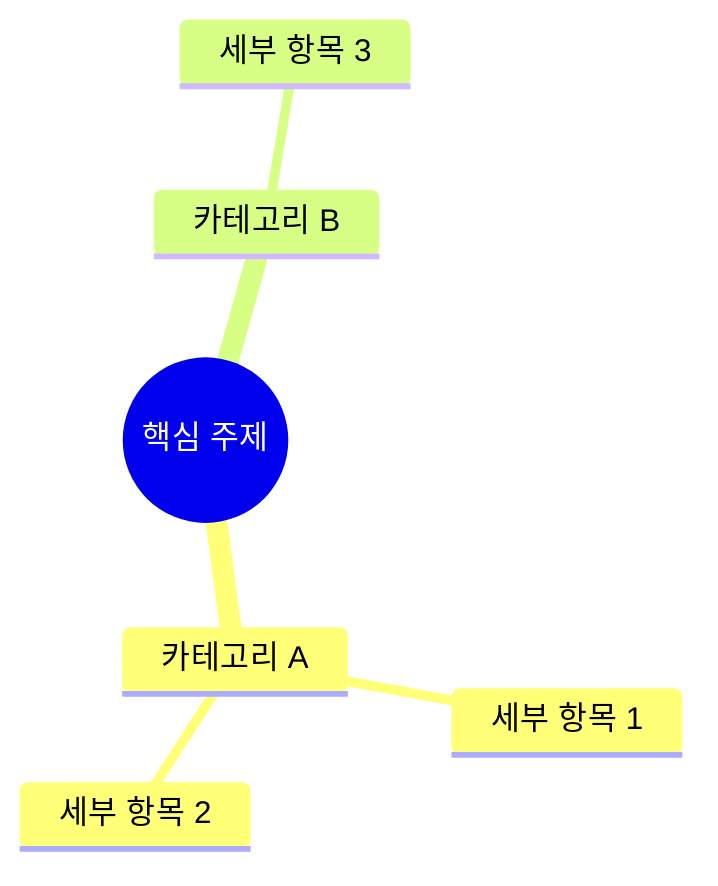
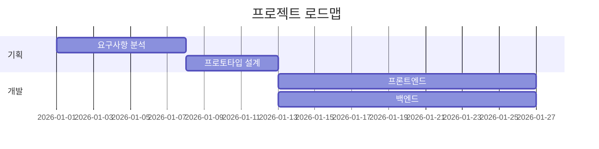
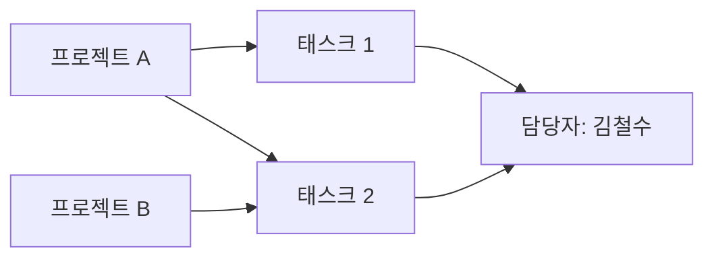

# Notion 시각화 가이드 (Visualization Notion)

## Version Information
**Current Version:** 1.0.0  
**Last Updated:** 2026-02-20  
**Changelog:**
- v1.0.0: Initial release — Notion MCP 연동, 7가지 시각화 유형 지원

## Dependencies
**Required MCP Servers:**
- Notion MCP (`https://mcp.notion.com/mcp`) — Notion 데이터 접근 필수

**Rendering Methods (no install needed):**
- Mermaid (flowchart, mindmap, gantt, timeline, kanban)
- React + Recharts (bar, line, pie, area charts)
- HTML/CSS (table, card grid, kanban board)
- SVG (custom diagrams)

---

## Overview

이 Skill은 Notion MCP를 통해 Notion 워크스페이스의 페이지·데이터베이스 콘텐츠를 읽고, 내용의 구조와 목적에 맞는 **최적의 시각화 도식**으로 자동 변환합니다.

사용자가 "이 Notion 페이지 시각화해줘" 라고 요청하면, Claude는 데이터를 분석하고 적합한 도식 유형을 선택하여 즉시 렌더링합니다.

---

## Core Instructions

### Step 1: Notion MCP 연결 확인
```
사용자가 Notion 시각화를 요청하면:
1. Notion MCP가 연결되어 있는지 확인
2. 미연결 시 → "Notion MCP 연결이 필요합니다. Settings > Integrations에서 Notion을 연결해주세요." 안내
3. 연결 확인 후 → 다음 단계 진행
```

### Step 2: Notion 콘텐츠 수집

사용자가 제공하는 정보에 따라 적절한 Notion MCP 도구 사용:

| 사용자 입력 | MCP 작업 |
|------------|---------|
| 페이지 URL 또는 ID | `notion_get_page` → 페이지 전체 내용 조회 |
| 데이터베이스 URL 또는 ID | `notion_query_database` → DB 항목 전체 조회 |
| "내 페이지 목록" | `notion_search` → 접근 가능한 페이지 검색 |
| 키워드만 입력 | `notion_search` → 키워드로 페이지 검색 후 선택 |
| 블록 단위 요청 | `notion_get_block_children` → 하위 블록 조회 |

### Step 3: 콘텐츠 분석 및 시각화 유형 자동 선택

수집된 데이터의 **구조와 목적**을 분석하여 최적 도식 자동 선택:

```
분석 기준:
├── 계층 구조 감지 (중첩 목록, 헤더 계층)  → 마인드맵 / 트리 다이어그램
├── 순서/흐름 감지 (번호 목록, 단계별 프로세스) → 플로우차트
├── 날짜 컬럼 감지 (Date 속성, 타임라인 DB)   → 타임라인 / Gantt 차트
├── 상태 컬럼 감지 (Select: 할일/진행중/완료) → 칸반 보드
├── 숫자 데이터 감지 (Number 속성 다수)       → 통계 차트 (Bar/Line/Pie)
├── 관계형 데이터 감지 (Relation 속성)        → 관계도 / 연결 다이어그램
└── 일반 텍스트/목록                          → 구조화된 카드 레이아웃
```

### Step 4: 시각화 렌더링

선택된 유형에 맞는 출력 형식으로 렌더링:

---

## 시각화 유형별 상세 가이드

### 🔷 Type 1: 플로우차트 (Flowchart)
**적합한 Notion 콘텐츠:** 프로세스 문서, SOP, 의사결정 트리, 단계별 가이드

**렌더링 방법:** Mermaid `.mermaid` 파일

**구현 패턴:**


**Notion 데이터 매핑:**
- 번호 목록 항목 → 노드
- 들여쓰기 → 연결 관계
- 체크박스 상태 → 노드 스타일 (완료/미완료)

---

### 🧠 Type 2: 마인드맵 (Mind Map)
**적합한 Notion 콘텐츠:** 브레인스토밍 페이지, 계층 구조 목록, 토글 목록

**렌더링 방법:** Mermaid mindmap

**구현 패턴:**


**Notion 데이터 매핑:**
- 페이지 제목 → root 노드
- H1/H2/H3 → 1·2·3단계 분기
- 글머리 기호 목록 → 말단 노드

---

### 📅 Type 3: 타임라인 & Gantt 차트
**적합한 Notion 콘텐츠:** 프로젝트 DB (날짜 속성 포함), 로드맵, 일정표

**렌더링 방법:** Mermaid gantt 또는 HTML 타임라인

**구현 패턴 (Gantt):**


**Notion 데이터 매핑:**
- DB 항목 이름 → 작업명
- Date 속성 (시작일/종료일) → 기간
- Select/Status 속성 → 섹션 그룹핑
- Assignee 속성 → 담당자 레이블

---

### 📋 Type 4: 칸반 보드 (Kanban Board)
**적합한 Notion 콘텐츠:** 할 일 DB, 스프린트 보드, 상태별 분류 DB

**렌더링 방법:** React 컴포넌트 (`.jsx`)

**구현 패턴:**
```jsx
// 상태별 컬럼 + 드래그 가능한 카드 UI
// Priority 색상 배지, Assignee 아바타, Due Date 표시
```

**Notion 데이터 매핑:**
- Select/Status 속성 값 → 칸반 컬럼
- 항목 이름 → 카드 제목
- 우선순위 속성 → 카드 배지 색상
- 담당자/날짜 → 카드 하단 메타정보

---

### 📊 Type 5: 통계 차트 (Statistical Charts)
**적합한 Notion 콘텐츠:** 수치 데이터가 있는 DB (매출, 점수, 수량 등)

**렌더링 방법:** React + Recharts

**지원 차트 유형:**
- **Bar Chart:** 카테고리 비교 (예: 부서별 매출)
- **Line Chart:** 시계열 추이 (예: 월별 성과)
- **Pie Chart:** 비율/구성 (예: 상태별 비율)
- **Area Chart:** 누적 추이

**Notion 데이터 매핑:**
- Select 속성 → X축 카테고리
- Number 속성 → Y축 값
- Date 속성 → 시계열 X축
- 여러 Number 속성 → 다중 계열(Series)

---

### 🗺️ Type 6: 관계도 (Relationship Diagram)
**적합한 Notion 콘텐츠:** Relation 속성이 있는 DB, 조직도, 의존성 맵

**렌더링 방법:** Mermaid graph 또는 HTML SVG

**구현 패턴:**


**Notion 데이터 매핑:**
- DB 항목 → 노드
- Relation 속성 연결 → 엣지(화살표)
- 속성 값 → 노드 레이블/스타일

---

### 🃏 Type 7: 카드 그리드 (Card Grid)
**적합한 Notion 콘텐츠:** 갤러리 뷰 DB, 포트폴리오, 멤버 목록, 제품 카탈로그

**렌더링 방법:** HTML/CSS 반응형 그리드

**구현 패턴:**
- 항목당 카드 1개
- 썸네일/아이콘, 제목, 설명, 태그 표시
- 호버 효과, 색상 배지

---

## 복합 시각화 (Multi-View Dashboard)

Notion DB에 다양한 속성이 혼재할 경우, 여러 시각화를 **하나의 대시보드**로 통합:

```
요청 예시: "우리 팀 프로젝트 DB 전체 현황 보여줘"

출력 구성:
┌─────────────────────────────────────┐
│  📊 상태별 현황 (Pie Chart)          │
│  📅 일정 타임라인 (Gantt)            │
│  📋 칸반 보드 (Kanban)              │
│  👥 담당자별 업무량 (Bar Chart)      │
└─────────────────────────────────────┘
```

---

## Output Format 결정 규칙

```
시각화 복잡도에 따른 출력 형식 선택:

단순 (노드 10개 이하, 단일 뷰):
  → Mermaid 다이어그램 (.mermaid 파일)

중간 (인터랙션 불필요, 복잡한 레이아웃):
  → HTML 파일 (.html)

복잡 (인터랙션 필요, 차트+필터+대시보드):
  → React 컴포넌트 (.jsx)

초대형 (수백 개 노드, 커스텀 레이아웃):
  → SVG 파일 (.svg)
```

---

## 파이프라인 통합 모드 (Pipeline Integration Modes)

### Mode A: 입력 시각화 (Agent 01)
- 트리거: Agent 01이 Notion URL/ID를 입력 자료로 받을 때
- 출력: docs/input-visualization/
- 권장: 마인드맵 (계층), 플로우차트 (프로세스)

### Mode B: QA 결과 시각화 (Agent 06/07)
- 트리거: Notion 로그 기록 후 호출
- 출력: docs/qa-logs/{날짜}_{페이지}/
- 성공 시: API 응답시간 Bar Chart + 성공 플로우차트
- 실패 시: 에러 분포 Pie Chart + 실패 지점 플로우차트

### Mode C: 파이프라인 대시보드 (온디맨드)
- 트리거: /pipeline-dashboard 커맨드
- 출력: docs/pipeline-dashboard/dashboard-{날짜}.html
- 구성: 통계 요약 + 상태별 칸반 + 성공/실패 추이 + 간트 차트

---

## When to Use

**✅ 이 Skill을 사용해야 할 때:**
- 사용자가 "Notion 페이지/DB를 시각화해달라"고 요청할 때
- Notion URL, 페이지 ID, 또는 DB 이름을 제공하며 도식화를 원할 때
- "Notion에서 가져와서 차트/플로우/마인드맵 만들어줘" 요청 시
- 프로젝트 현황, 로드맵, 팀 업무 등 Notion 데이터를 보고서로 만들 때
- 파이프라인 Agent가 Mode A/B/C로 호출하는 경우 (자동 통합)

**❌ 이 Skill을 사용하지 말아야 할 때:**
- Notion 연동 없이 단순 텍스트로 다이어그램 그릴 때 (다른 시각화 Skill 사용)
- Notion에 데이터를 **쓰거나 수정**할 때 (이 Skill은 읽기 전용)
- Notion MCP가 연결되지 않은 환경

**🔗 다른 Skill과 조합:**
- `docx` Skill: 시각화 결과를 Word 문서에 삽입
- `pptx` Skill: 시각화를 프레젠테이션 슬라이드로 변환
- `pdf` Skill: 시각화 대시보드를 PDF 보고서로 저장

---

## Error Handling

| 상황 | 대응 |
|------|------|
| Notion MCP 미연결 | 연결 방법 안내 후 중단 |
| 페이지 접근 권한 없음 | 권한 확인 요청, 공유 설정 안내 |
| 빈 페이지/DB | "콘텐츠가 없습니다" 안내 |
| 데이터 너무 많음 (100개↑) | 상위 50개로 제한하고 필터 제안 |
| 시각화 유형 불명확 | 사용자에게 선택지 제시 |

---

## Resources

```
visualization-notion/
├── SKILL.md                    ← 이 파일 (메인 지침)
├── REFERENCE.md                ← 시각화 유형별 상세 예시
└── resources/
    ├── templates/
    │   ├── kanban-template.jsx      ← 칸반 React 템플릿
    │   ├── dashboard-template.html  ← 대시보드 HTML 템플릿
    │   └── chart-template.jsx       ← Recharts 차트 템플릿
    └── examples/
        ├── example-flowchart.md     ← 플로우차트 예시
        ├── example-mindmap.md       ← 마인드맵 예시
        └── example-dashboard.md    ← 대시보드 예시
```
