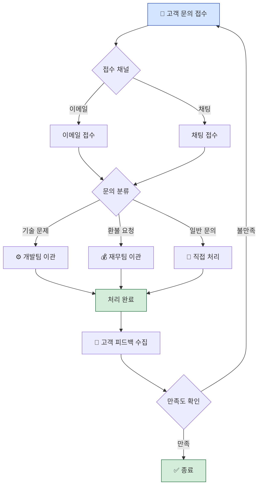

# 플로우차트 예시 — Notion 프로세스 페이지 시각화

## 원본 Notion 페이지 구조

```
# 고객 문의 처리 프로세스

1. 문의 접수
   - 이메일로 접수
   - 채팅으로 접수
2. 문의 분류
   - 기술 문제 → 개발팀 이관
   - 환불 요청 → 재무팀 이관
   - 일반 문의 → 직접 처리
3. 처리 완료
4. 고객 피드백 수집
```

## 생성된 Mermaid 플로우차트


