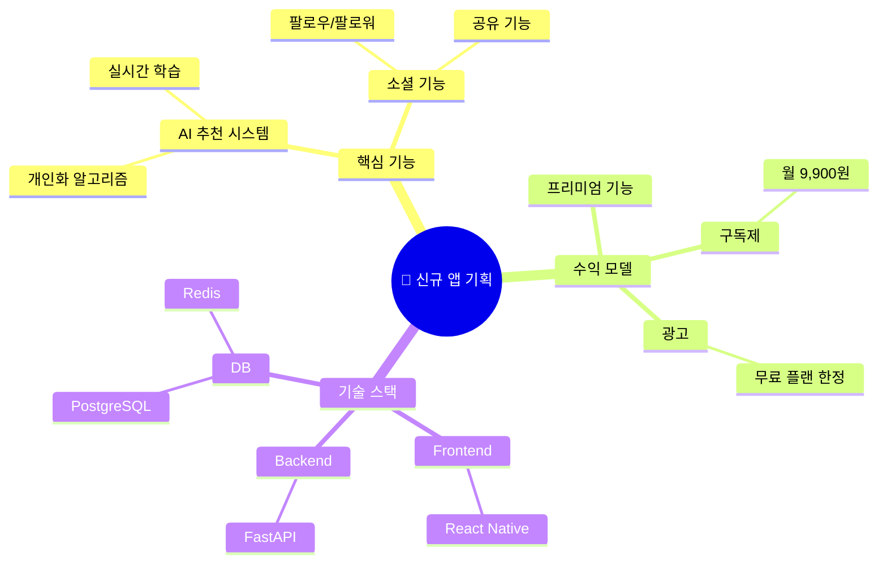

# 마인드맵 예시 — Notion 브레인스토밍 페이지 시각화

## 원본 Notion 페이지 구조

```
# 신규 앱 기획

## 핵심 기능
- AI 추천 시스템
  - 개인화 알고리즘
  - 실시간 학습
- 소셜 기능
  - 팔로우/팔로워
  - 공유 기능

## 수익 모델
- 구독제 (월 9,900원)
- 프리미엄 기능
- 광고 (무료 플랜)

## 기술 스택
- Frontend: React Native
- Backend: FastAPI
- DB: PostgreSQL + Redis
```

## 생성된 Mermaid 마인드맵


