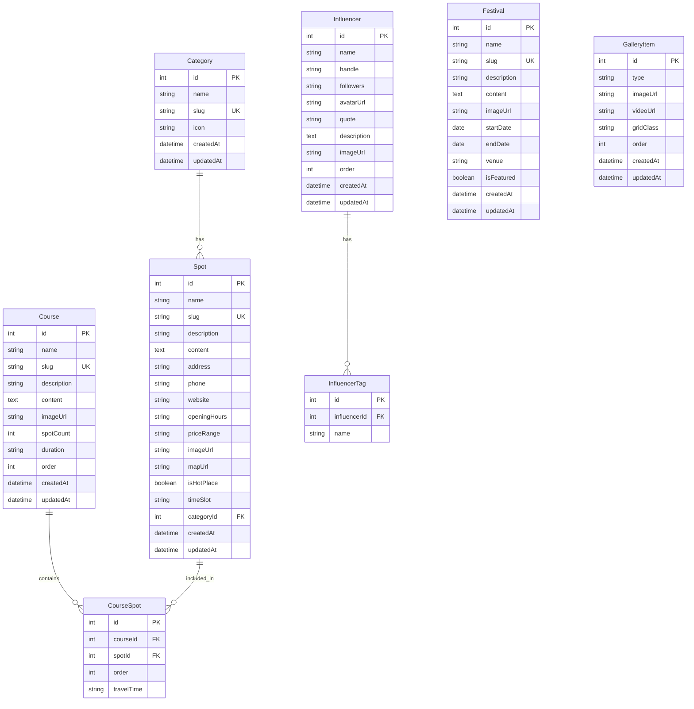
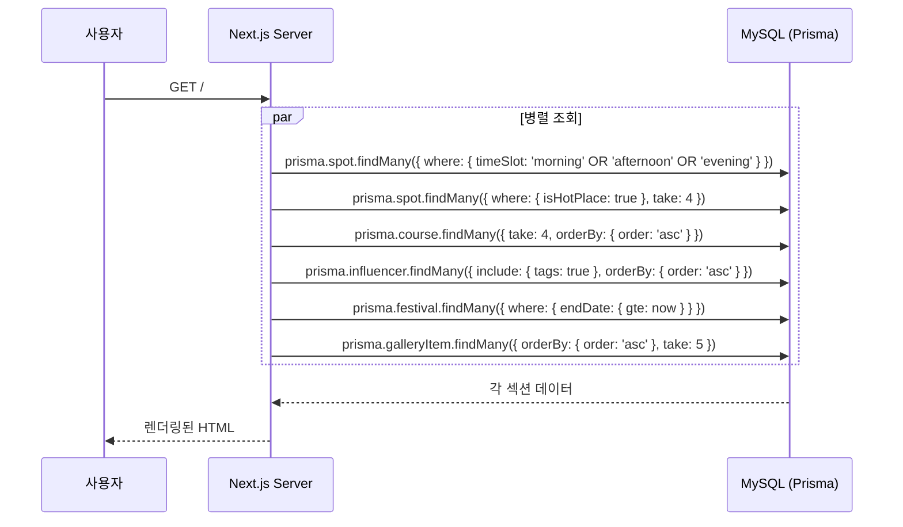
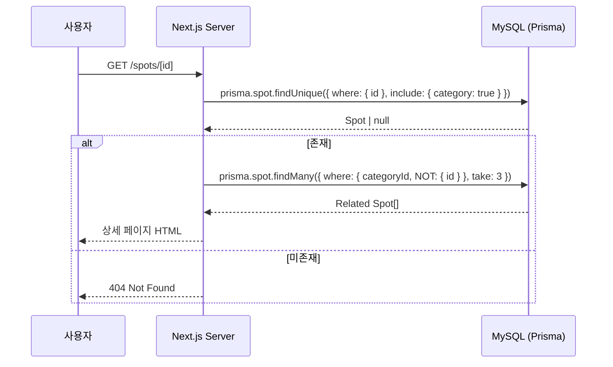
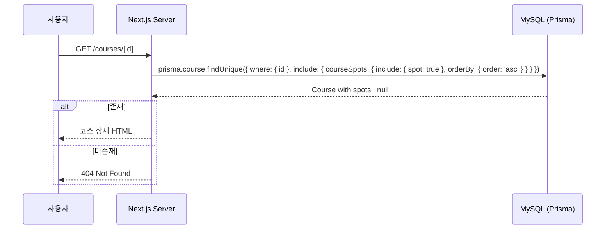

# Visit Gangnam API 명세

> 소스: `디자인_비짓강남_메인_v1_B.html` 기반 데이터 모델
> Next.js App Router — Server Component에서 Prisma 직접 호출이 기본.
> API Routes는 Health Check + 향후 어드민 CMS 연동용.

---

## 엔드포인트 목록

| Method | Path | 설명 | 사용처 |
|---|---|---|---|
| GET | `/api/health` | 서비스/DB 상태 확인 | 배포 헬스체크 |
| GET | `/api/spots` | 스팟 목록 | 향후 어드민/외부 연동 |
| GET | `/api/spots/[id]` | 스팟 상세 | 향후 어드민/외부 연동 |
| GET | `/api/courses` | 여행코스 목록 | 향후 어드민/외부 연동 |
| GET | `/api/courses/[id]` | 여행코스 상세 | 향후 어드민/외부 연동 |
| GET | `/api/festivals` | 축제/행사 목록 | 향후 어드민/외부 연동 |
| GET | `/api/categories` | 카테고리 목록 | 향후 어드민/외부 연동 |

> **현재 파이프라인**: 대부분의 데이터는 Server Component에서 Prisma 직접 호출.
> API Routes는 기본 구조만 생성하고, 어드민 CMS 파이프라인에서 확장.

---

## 1. Health Check

- **Method**: GET
- **Path**: `/api/health`

### Response

| Status | Body | 설명 |
|---|---|---|
| 200 | `{ "status": "ok", "db": "connected", "timestamp": "..." }` | 정상 |
| 503 | `{ "status": "error", "db": "disconnected", "timestamp": "..." }` | DB 연결 실패 |

---

## 2. 스팟 목록

- **Method**: GET
- **Path**: `/api/spots`

### Query Parameters

| 파라미터 | 타입 | 필수 | 설명 |
|---|---|---|---|
| `category` | string | N | 카테고리 slug 필터 (see, eat, play) |
| `hotplace` | boolean | N | 핫플레이스만 조회 |
| `timeSlot` | string | N | 시간대 필터 (morning, afternoon, evening) |

### Response (200)

```json
{
  "data": [
    {
      "id": 1,
      "name": "코엑스 별마당 도서관",
      "slug": "coex-starfield-library",
      "description": "삼성동 · 문화공간",
      "content": "코엑스몰 내 위치한 대형 개방형 도서관...",
      "address": "서울특별시 강남구 영동대로 513",
      "phone": "02-6002-5300",
      "website": "https://www.starfield.co.kr/coexmall",
      "openingHours": "10:30 - 22:00",
      "priceRange": null,
      "imageUrl": "/images/spots/coex-library.jpg",
      "mapUrl": "https://map.naver.com/...",
      "isHotPlace": true,
      "timeSlot": "morning",
      "category": {
        "id": 1,
        "name": "볼거리",
        "slug": "see",
        "icon": "🏛"
      },
      "createdAt": "2026-02-20T00:00:00.000Z"
    }
  ],
  "count": 1
}
```

---

## 3. 스팟 상세

- **Method**: GET
- **Path**: `/api/spots/[id]`

### Response (200)

```json
{
  "data": {
    "id": 1,
    "name": "코엑스 별마당 도서관",
    "slug": "coex-starfield-library",
    "description": "삼성동 · 문화공간",
    "content": "코엑스몰 내 위치한 대형 개방형 도서관으로...",
    "address": "서울특별시 강남구 영동대로 513",
    "phone": "02-6002-5300",
    "website": "https://www.starfield.co.kr/coexmall",
    "openingHours": "10:30 - 22:00",
    "priceRange": null,
    "imageUrl": "/images/spots/coex-library.jpg",
    "mapUrl": "https://map.naver.com/...",
    "isHotPlace": true,
    "timeSlot": "morning",
    "category": {
      "id": 1,
      "name": "볼거리",
      "slug": "see",
      "icon": "🏛"
    },
    "relatedSpots": [
      {
        "id": 4,
        "name": "봉은사 야경",
        "slug": "bongeunsa-night",
        "description": "삼성동 · 야경명소",
        "imageUrl": "/images/spots/bongeunsa.jpg",
        "category": { "name": "볼거리", "slug": "see", "icon": "🏛" }
      }
    ],
    "createdAt": "2026-02-20T00:00:00.000Z",
    "updatedAt": "2026-02-20T00:00:00.000Z"
  }
}
```

### Error Response

| Status | Body | 설명 |
|---|---|---|
| 404 | `{ "error": "Spot not found" }` | 미존재 |
| 500 | `{ "error": "Internal Server Error" }` | 서버 에러 |

---

## 4. 여행코스 목록

- **Method**: GET
- **Path**: `/api/courses`

### Response (200)

```json
{
  "data": [
    {
      "id": 1,
      "name": "K-POP 성지순례",
      "slug": "kpop-pilgrimage",
      "description": "K-POP 팬을 위한 강남 성지순례 코스",
      "imageUrl": "/images/courses/kpop.jpg",
      "spotCount": 5,
      "duration": "약 4시간",
      "order": 1,
      "createdAt": "2026-02-20T00:00:00.000Z"
    }
  ],
  "count": 4
}
```

---

## 5. 여행코스 상세

- **Method**: GET
- **Path**: `/api/courses/[id]`

### Response (200)

```json
{
  "data": {
    "id": 1,
    "name": "K-POP 성지순례",
    "slug": "kpop-pilgrimage",
    "description": "K-POP 팬을 위한 강남 성지순례 코스",
    "content": "강남은 K-POP의 심장부입니다...",
    "imageUrl": "/images/courses/kpop.jpg",
    "spotCount": 5,
    "duration": "약 4시간",
    "courseSpots": [
      {
        "order": 1,
        "travelTime": null,
        "spot": {
          "id": 1,
          "name": "SM엔터테인먼트",
          "description": "압구정동 · 엔터",
          "imageUrl": "/images/spots/sm.jpg"
        }
      },
      {
        "order": 2,
        "travelTime": "도보 10분",
        "spot": {
          "id": 2,
          "name": "JYP엔터테인먼트",
          "description": "청담동 · 엔터",
          "imageUrl": "/images/spots/jyp.jpg"
        }
      }
    ]
  }
}
```

---

## 6. 축제/행사 목록

- **Method**: GET
- **Path**: `/api/festivals`

### Query Parameters

| 파라미터 | 타입 | 필수 | 설명 |
|---|---|---|---|
| `featured` | boolean | N | 피처드 축제만 |
| `status` | string | N | live, soon, ended |

### Response (200)

```json
{
  "data": [
    {
      "id": 1,
      "name": "2026 GANGNAM FESTIVAL",
      "slug": "2026-gangnam-festival",
      "description": "강남구 최대 규모의 축제",
      "imageUrl": "/images/festivals/gangnam-fest.jpg",
      "startDate": "2026-04-01",
      "endDate": "2026-04-15",
      "venue": "코엑스 일대",
      "isFeatured": true,
      "createdAt": "2026-02-20T00:00:00.000Z"
    }
  ],
  "count": 1
}
```

---

## 7. 카테고리 목록

- **Method**: GET
- **Path**: `/api/categories`

### Response (200)

```json
{
  "data": [
    { "id": 1, "name": "볼거리", "slug": "see", "icon": "🏛" },
    { "id": 2, "name": "먹거리", "slug": "eat", "icon": "🍽" },
    { "id": 3, "name": "즐길거리", "slug": "play", "icon": "🎭" }
  ]
}
```

---

## DB 스키마 (Prisma)

### ER 다이어그램



### Prisma Schema

```prisma
datasource db {
  provider = "mysql"
  url      = env("DATABASE_URL")
}

generator client {
  provider = "prisma-client-js"
}

model Category {
  id        Int      @id @default(autoincrement())
  name      String
  slug      String   @unique
  icon      String
  spots     Spot[]
  createdAt DateTime @default(now())
  updatedAt DateTime @updatedAt

  @@map("categories")
}

model Spot {
  id           Int          @id @default(autoincrement())
  name         String
  slug         String       @unique
  description  String
  content      String?      @db.LongText
  address      String
  phone        String?
  website      String?
  openingHours String?
  priceRange   String?
  imageUrl     String?
  mapUrl       String?
  isHotPlace   Boolean      @default(false)
  timeSlot     String?      // morning | afternoon | evening
  categoryId   Int
  category     Category     @relation(fields: [categoryId], references: [id])
  courseSpots   CourseSpot[]
  createdAt    DateTime     @default(now())
  updatedAt    DateTime     @updatedAt

  @@index([categoryId])
  @@index([isHotPlace])
  @@index([timeSlot])
  @@map("spots")
}

model Course {
  id          Int          @id @default(autoincrement())
  name        String
  slug        String       @unique
  description String
  content     String?      @db.LongText
  imageUrl    String?
  spotCount   Int          @default(0)
  duration    String?
  order       Int          @default(0)
  courseSpots  CourseSpot[]
  createdAt   DateTime     @default(now())
  updatedAt   DateTime     @updatedAt

  @@map("courses")
}

model CourseSpot {
  id         Int    @id @default(autoincrement())
  courseId   Int
  spotId     Int
  order      Int    @default(0)
  travelTime String?
  course     Course @relation(fields: [courseId], references: [id], onDelete: Cascade)
  spot       Spot   @relation(fields: [spotId], references: [id], onDelete: Cascade)

  @@unique([courseId, spotId])
  @@index([courseId])
  @@index([spotId])
  @@map("course_spots")
}

model Festival {
  id          Int      @id @default(autoincrement())
  name        String
  slug        String   @unique
  description String
  content     String?  @db.LongText
  imageUrl    String?
  startDate   DateTime @db.Date
  endDate     DateTime @db.Date
  venue       String?
  isFeatured  Boolean  @default(false)
  createdAt   DateTime @default(now())
  updatedAt   DateTime @updatedAt

  @@index([isFeatured])
  @@index([startDate])
  @@map("festivals")
}

model Influencer {
  id          Int              @id @default(autoincrement())
  name        String
  handle      String
  followers   String
  avatarUrl   String?
  quote       String           @db.Text
  description String?          @db.Text
  imageUrl    String?
  order       Int              @default(0)
  tags        InfluencerTag[]
  createdAt   DateTime         @default(now())
  updatedAt   DateTime         @updatedAt

  @@map("influencers")
}

model InfluencerTag {
  id           Int        @id @default(autoincrement())
  name         String
  influencerId Int
  influencer   Influencer @relation(fields: [influencerId], references: [id], onDelete: Cascade)

  @@index([influencerId])
  @@map("influencer_tags")
}

model GalleryItem {
  id        Int      @id @default(autoincrement())
  type      String   // video | image
  imageUrl  String
  videoUrl  String?
  gridClass String   // gal-1, gal-2, gal-3, gal-4, gal-5
  order     Int      @default(0)
  createdAt DateTime @default(now())
  updatedAt DateTime @updatedAt

  @@map("gallery_items")
}
```

---

## Server Component 데이터 조회 패턴

메인 페이지의 각 섹션은 Server Component에서 Prisma를 직접 호출합니다.

### 메인 페이지 데이터 조회



### 스팟 상세 조회



### 코스 상세 조회



---

## 공통 응답 형식

### 성공

```json
{ "data": "...", "count": 10 }
```

### 에러

```json
{ "error": "에러 메시지" }
```

---

## TypeScript 타입 정의

```typescript
// types/index.ts

export interface Category {
  id: number;
  name: string;
  slug: string;
  icon: string;
}

export interface Spot {
  id: number;
  name: string;
  slug: string;
  description: string;
  imageUrl: string | null;
  isHotPlace: boolean;
  timeSlot: string | null;
  category: Category;
  createdAt: string;
}

export interface SpotDetail extends Spot {
  content: string | null;
  address: string;
  phone: string | null;
  website: string | null;
  openingHours: string | null;
  priceRange: string | null;
  mapUrl: string | null;
  relatedSpots: Spot[];
  updatedAt: string;
}

export interface Course {
  id: number;
  name: string;
  slug: string;
  description: string;
  imageUrl: string | null;
  spotCount: number;
  duration: string | null;
  order: number;
}

export interface CourseSpot {
  order: number;
  travelTime: string | null;
  spot: Spot;
}

export interface CourseDetail extends Course {
  content: string | null;
  courseSpots: CourseSpot[];
}

export interface Festival {
  id: number;
  name: string;
  slug: string;
  description: string;
  imageUrl: string | null;
  startDate: string;
  endDate: string;
  venue: string | null;
  isFeatured: boolean;
}

export interface Influencer {
  id: number;
  name: string;
  handle: string;
  followers: string;
  avatarUrl: string | null;
  quote: string;
  description: string | null;
  imageUrl: string | null;
  tags: { id: number; name: string }[];
}

export interface GalleryItem {
  id: number;
  type: 'video' | 'image';
  imageUrl: string;
  videoUrl: string | null;
  gridClass: string;
  order: number;
}

export interface ApiResponse<T> {
  data: T;
  count?: number;
}

export interface ApiError {
  error: string;
}
```
