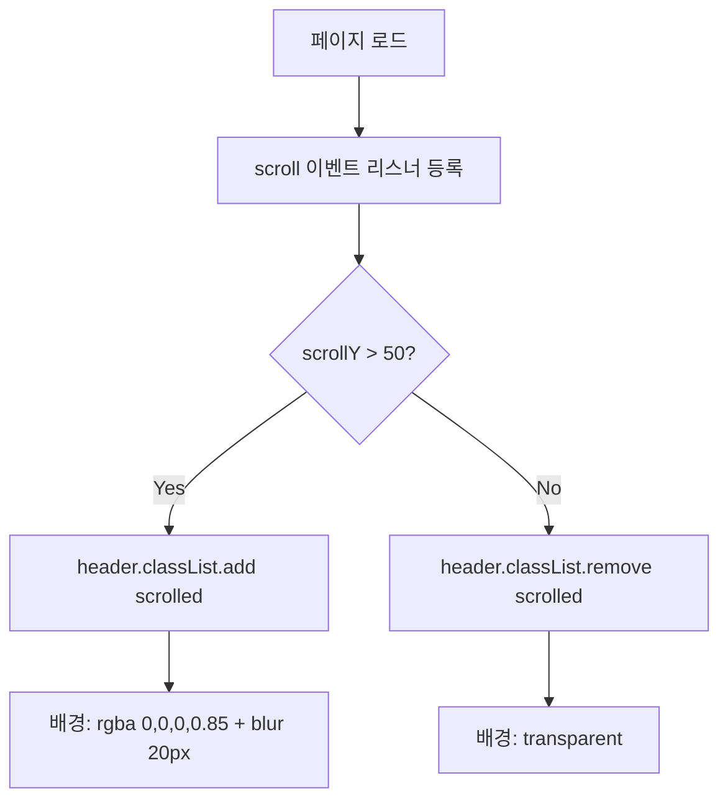
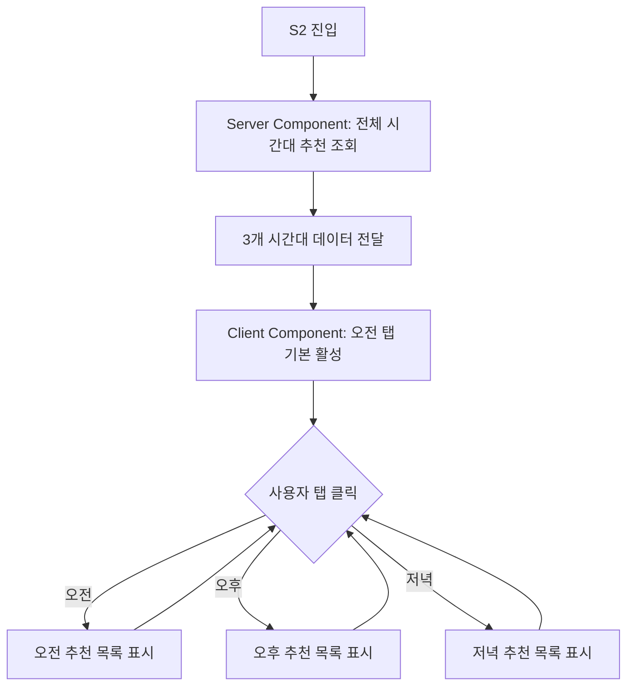
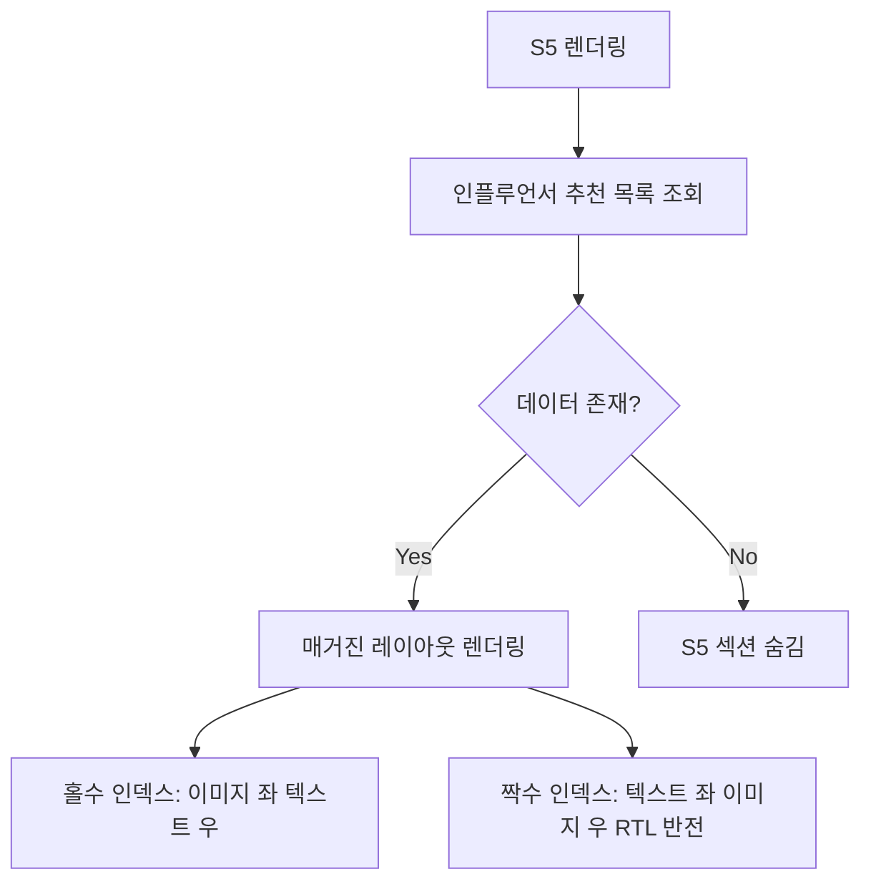
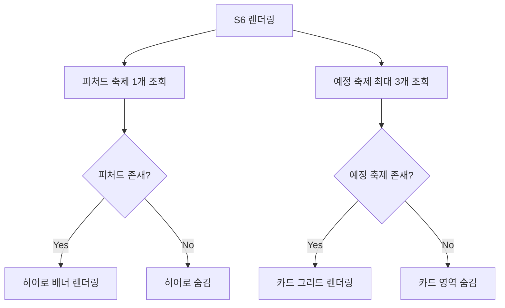
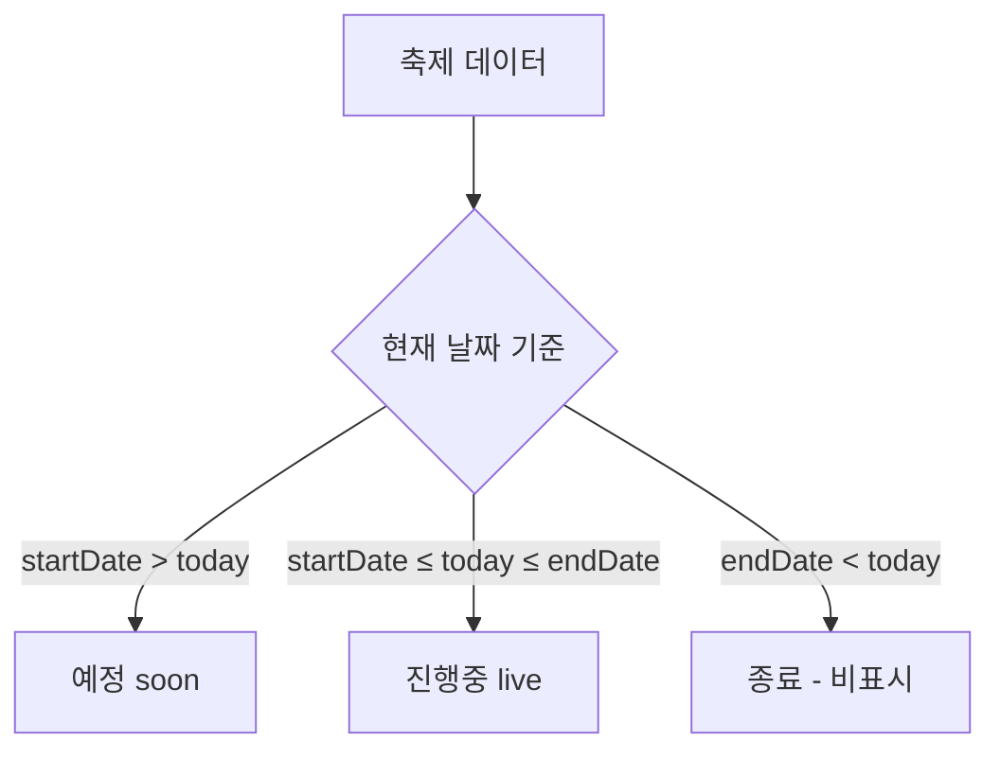
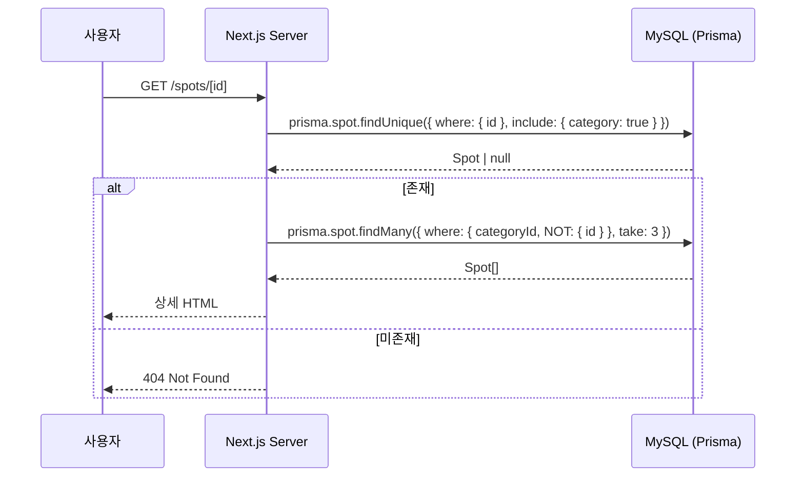
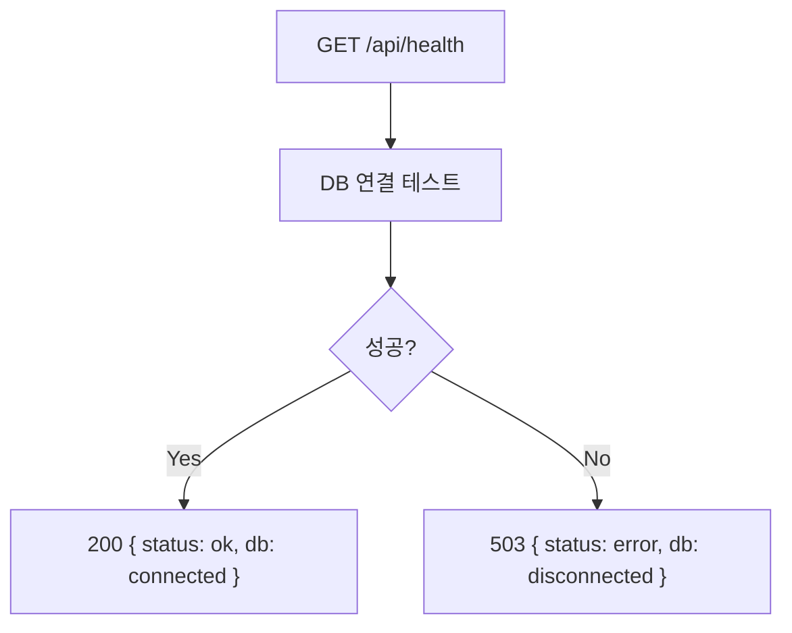

# Visit Gangnam 기능명세서

> 소스: `디자인_비짓강남_메인_v1_B.html` (시네마틱 몰입형 B안)
> 현재 파이프라인: 프론트엔드 + API + DB 개발 (어드민 CMS는 다음 파이프라인)

---

## 1. Header 스크롤 인터랙션

### 비즈니스 로직
- 페이지 로드 시 Header 배경 투명
- `window.scrollY > 50` 일 때 `.scrolled` 클래스 토글
- CSS transition 0.4s로 부드러운 전환

### 플로우차트



### 구현 참고
- Next.js: `useEffect` + `window.addEventListener('scroll', ...)`
- `'use client'` 컴포넌트로 분리

---

## 2. 지금 강남은 — 시간대 탭 전환

### 비즈니스 로직
- 3개 탭: 오전, 오후, 저녁
- 탭 클릭 시 해당 시간대의 추천 장소 목록 전환
- 초기 활성 탭: "오전"
- 추천 장소는 DB에서 `timeSlot` 필드 기준 조회

### 플로우차트



### 분기 조건

| 조건 | 결과 |
|---|---|
| 오전 탭 클릭 | timeSlot=morning 데이터 표시, 활성 탭 스타일 |
| 오후 탭 클릭 | timeSlot=afternoon 데이터 표시 |
| 저녁 탭 클릭 | timeSlot=evening 데이터 표시 |
| 해당 시간대 데이터 0개 | "추천 장소를 준비중입니다" 메시지 |

### 예외 처리

| 예외 | 처리 방식 |
|---|---|
| DB 조회 실패 | Server Component error.tsx → 에러 바운더리 |
| 이미지 로드 실패 | next/image placeholder 표시 |

---

## 3. 핫플레이스 — 확장 패널 인터랙션

### 비즈니스 로직
- 4개 패널이 동일 너비로 배치 (flex: 1)
- 마우스 호버 시 해당 패널 확장 (flex: 2), 이미지 줌 (scale 1.05)
- 클릭 시 해당 스팟 상세 페이지 이동
- 데이터: `isHotPlace=true`인 스팟 상위 4개 조회

### 플로우차트

```mermaid
flowchart TD
  A[S3 렌더링] --> B[isHotPlace=true 스팟 4개 조회]
  B --> C{데이터 4개 이상?}
  C -->|Yes| D[4개 패널 렌더링]
  C -->|No| E[있는 만큼 렌더링]
  D --> F{사용자 호버}
  F -->|패널 진입| G[flex:2 확장 + 이미지 scale 1.05]
  F -->|패널 이탈| H[flex:1 복원]
  G --> I{클릭?}
  I -->|Yes| J[/spots/id 이동]
  I -->|No| F

  %% TC-05: 4개 패널 정상 표시
  %% TC-06: 호버 확장 동작
  %% TC-07: 클릭 시 상세 이동
  %% TC-08: 모바일에서 세로 전환
```

### 분기 조건

| 조건 | 결과 |
|---|---|
| 핫플레이스 4개 이상 | 상위 4개 표시 |
| 핫플레이스 4개 미만 | 있는 만큼 표시 (flex 균등 배분) |
| 핫플레이스 0개 | S3 섹션 숨김 |
| Mobile (≤768px) | 세로 전환, 확장 비활성 |

---

## 4. 테마여행 코스

### 비즈니스 로직
- DB에서 여행코스 목록 조회 (최대 4개)
- 각 코스: 이름, 이미지, 스팟 수, 예상 소요시간
- "코스 보기" 클릭 시 `/courses/[id]` 이동

### 플로우차트

```mermaid
flowchart TD
  A[S4 렌더링] --> B[여행코스 목록 조회 최대 4개]
  B --> C{코스 존재?}
  C -->|Yes| D[2×2 그리드 렌더링]
  C -->|No| E[S4 섹션 숨김]
  D --> F{코스 보기 클릭}
  F --> G[/courses/id 이동]

  %% TC-09: 코스 4개 표시
  %% TC-10: 코스 보기 클릭 이동
  %% TC-11: 코스 0개 시 숨김
```

---

## 5. 인플루언서 추천

### 비즈니스 로직
- DB에서 인플루언서 추천 콘텐츠 조회
- 매거진 레이아웃: 홀수 → 이미지 좌/텍스트 우, 짝수 → 반전
- 각 인플루언서: 프로필(아바타,이름,핸들), 인용문, 설명, 태그

### 플로우차트



---

## 6. 축제/행사

### 비즈니스 로직
- 메인 축제 히어로: `isFeatured=true`인 최신 축제 1개
- 하단 카드: 예정 축제 최대 3개
- 뱃지: 진행중(live) = --primary, 예정(soon) = --secondary
- "자세히 보기" 클릭 시 `/festivals/[id]` 이동

### 플로우차트



### 축제 상태 판별



---

## 7. 갤러리 (강남을 보다)

### 비즈니스 로직
- DB에서 갤러리 아이템 조회 (최대 5개)
- 첫 번째 아이템: 영상 (플레이 버튼 오버레이)
- 나머지: 이미지
- 비대칭 그리드 배치 (12컬럼 시스템)
- 플레이 버튼 클릭 시: YouTube 임베드 모달 또는 외부 링크

### 분기 조건

| 조건 | 결과 |
|---|---|
| 갤러리 5개 이상 | 5개만 표시 (그리드 레이아웃) |
| 갤러리 5개 미만 | 있는 만큼 표시, 그리드 조정 |
| 갤러리 0개 | S7 섹션 숨김 |
| 영상 아이템 | 플레이 버튼 오버레이 표시 |
| 이미지 아이템 | 플레이 버튼 없음 |

---

## 8. 스팟 상세 페이지

### 비즈니스 로직
- URL `[id]`로 스팟 조회
- 존재하지 않으면 404
- 같은 카테고리 관련 스팟 3개 추가 조회
- 정적 생성: `generateStaticParams`

### 플로우차트

```mermaid
flowchart TD
  A[/spots/id 접속] --> B[Prisma로 스팟 조회]
  B --> C{존재?}
  C -->|Yes| D[상세 렌더링]
  C -->|No| E[notFound → 404]
  D --> F[같은 카테고리 관련 스팟 3개 조회]
  F --> G{관련 스팟 존재?}
  G -->|Yes| H[관련 스팟 섹션 표시]
  G -->|No| I[관련 스팟 숨김]

  %% TC-17: 상세 정상 표시
  %% TC-18: 404 처리
  %% TC-19: 관련 스팟 표시
```

### 시퀀스 다이어그램



---

## 9. 여행코스 상세 페이지

### 비즈니스 로직
- URL `[id]`로 코스 조회 (포함된 스팟 순서대로)
- 존재하지 않으면 404
- 타임라인 형태로 스팟 순서 표시

### 플로우차트

```mermaid
flowchart TD
  A[/courses/id 접속] --> B[코스 + 연결 스팟 조회]
  B --> C{존재?}
  C -->|Yes| D[히어로 + 스팟 타임라인 렌더링]
  C -->|No| E[notFound → 404]

  %% TC-20: 코스 상세 + 스팟 순서
  %% TC-21: 404 처리
```

---

## 10. Health Check API

### 플로우차트



---

## 11. 시드 데이터 정책

어드민 CMS 없이 Prisma Seed로 초기 데이터 투입.

### 카테고리

| slug | name | icon |
|---|---|---|
| see | 볼거리 | 🏛 |
| eat | 먹거리 | 🍽 |
| play | 즐길거리 | 🎭 |

### 스팟 시드 (핫플레이스 + 시간대별 추천)

| name | category | isHotPlace | timeSlot |
|---|---|---|---|
| 코엑스 별마당 도서관 | see | true | morning |
| 청담동 한정식 | eat | true | afternoon |
| 압구정 로데오거리 | play | true | afternoon |
| 봉은사 야경 | see | true | evening |
| 가로수길 브런치 카페 | eat | false | morning |
| 양재시민의숲 | see | false | morning |
| 삼성미술관 리움 | see | false | morning |
| (추가 8~12개) | ... | false | ... |

### 여행코스 시드

| name | spotCount | duration |
|---|---|---|
| K-POP 성지순례 | 5 | 약 4시간 |
| 강남 미식 투어 | 6 | 약 5시간 |
| K-뷰티 체험 코스 | 4 | 약 3시간 |
| 강남 둘레길 트레킹 | 8 | 약 6시간 |

### 축제/행사 시드

| name | isFeatured | status |
|---|---|---|
| 2026 GANGNAM FESTIVAL | true | soon |
| 강남 K-POP 콘서트 | false | soon |
| 아트 강남 2026 | false | soon |
| 강남 미식 위크 | false | soon |

### 인플루언서 시드

| name | handle | followers |
|---|---|---|
| 김서현 | @seohyun_eats | 12.3만 |
| Alex Kim | @alexinseoul | 98K |

### 갤러리 시드

| type | position | hasVideo |
|---|---|---|
| video | gal-1 | true |
| image | gal-2 | false |
| image | gal-3 | false |
| image | gal-4 | false |
| image | gal-5 | false |

---

## 전체 사용자 시나리오 플로우

```mermaid
flowchart TD
  A[메인 페이지 접속] --> B{어떤 섹션/액션?}

  B -->|S2 시간대 탭| C[오전/오후/저녁 전환]
  B -->|S3 핫플 패널 호버| D[패널 확장]
  D -->|클릭| E[/spots/id]
  B -->|S2 추천 아이템 클릭| E
  B -->|S4 코스 보기| F[/courses/id]
  B -->|S6 자세히 보기| G[/festivals/id]
  B -->|S6 카드 클릭| G
  B -->|S7 갤러리 플레이| H[영상 재생/외부 링크]
  B -->|네비 - 볼거리| I[해당 섹션 스크롤]
  B -->|네비 - 여행코스| J[해당 섹션 스크롤]

  E --> K{스팟 상세에서}
  K -->|뒤로가기| A
  K -->|관련 스팟 클릭| E
  K -->|지도 보기| L[외부 지도]

  F --> M{코스 상세에서}
  M -->|뒤로가기| A
  M -->|스팟 클릭| E
```

---

## 정책 요약

| 정책 | 값 |
|---|---|
| 핫플레이스 표시 수 | 4개 (isHotPlace=true) |
| 시간대별 추천 | 3개/시간대 |
| 테마 코스 표시 수 | 최대 4개 |
| 인플루언서 표시 수 | 최대 2명 |
| 피처드 축제 | 1개 (히어로) |
| 예정 축제 카드 | 최대 3개 |
| 갤러리 아이템 | 5개 (1 영상 + 4 이미지) |
| 관련 스팟 | 3개 |
| 존재하지 않는 ID | `notFound()` → 404 |
| DB 연결 실패 | error.tsx 에러 바운더리 |
| 빈 섹션 | 데이터 0개 시 해당 섹션 숨김 |
| 정적 생성 | 스팟/코스 상세: generateStaticParams |
| 초기 데이터 | Prisma Seed |
| 어드민(CMS) | 다음 파이프라인 |

---

## TC 목록 (QA Agent 도출용)

| TC | 시나리오 | 분류 |
|---|---|---|
| TC-01 | 오전 탭 기본 표시 | S2 |
| TC-02 | 오후 탭 전환 | S2 |
| TC-03 | 저녁 탭 전환 | S2 |
| TC-04 | 추천 데이터 없을 때 | S2 |
| TC-05 | 핫플 4개 정상 표시 | S3 |
| TC-06 | 핫플 호버 확장 동작 | S3 |
| TC-07 | 핫플 클릭 시 상세 이동 | S3 |
| TC-08 | 모바일 핫플 세로 전환 | S3 |
| TC-09 | 코스 4개 표시 | S4 |
| TC-10 | 코스 보기 클릭 이동 | S4 |
| TC-11 | 코스 0개 시 숨김 | S4 |
| TC-12 | 인플루언서 교대 배치 | S5 |
| TC-13 | 인플루언서 0명 시 숨김 | S5 |
| TC-14 | 피처드 축제 + 예정 3개 | S6 |
| TC-15 | 피처드만 있음 | S6 |
| TC-16 | 축제 0개 시 숨김 | S6 |
| TC-17 | 스팟 상세 정상 표시 | 상세 |
| TC-18 | 스팟 404 처리 | 상세 |
| TC-19 | 관련 스팟 표시 | 상세 |
| TC-20 | 코스 상세 + 스팟 순서 | 상세 |
| TC-21 | 코스 404 처리 | 상세 |
