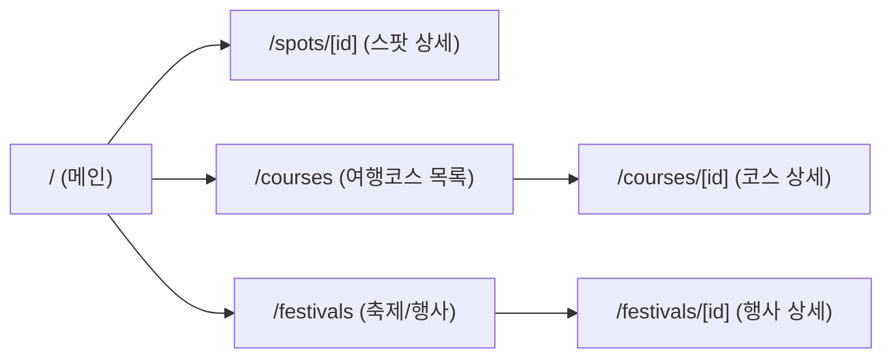
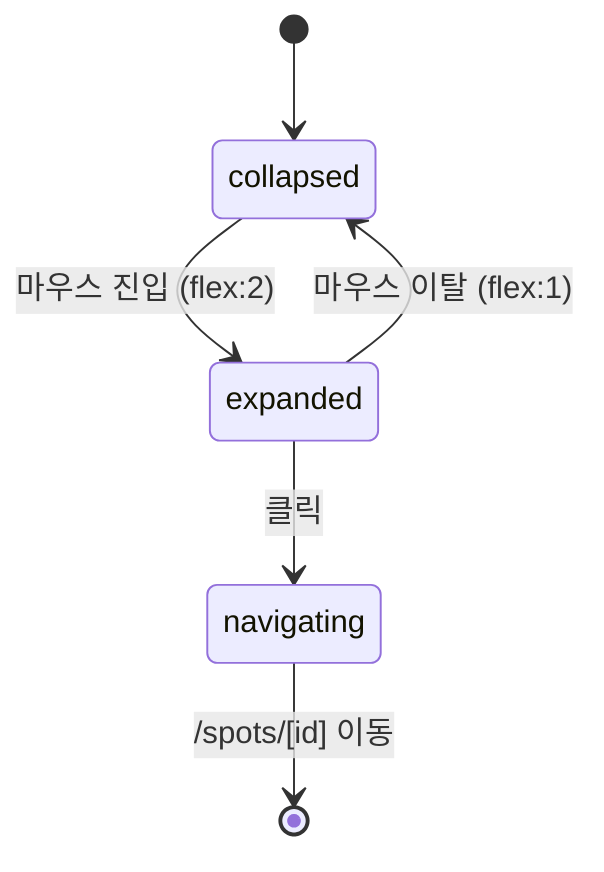
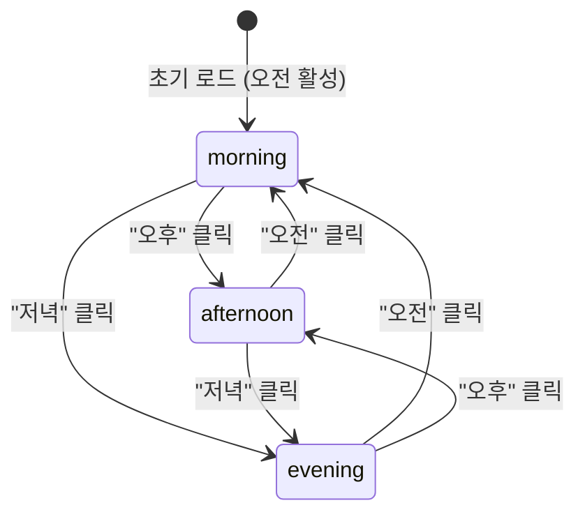

# Visit Gangnam 화면명세서

> 소스: `디자인_비짓강남_메인_v1_B.html` (시네마틱 몰입형 B안)
> 디자인 토큰(폰트, 색상 등)은 `docs/디자인시스템.md` 참조.
> **폰트 스타일과 색상은 반드시 원본 디자인 그대로 유지합니다.**

---

## 페이지 구조



| 페이지 | 경로 | 설명 | 소스 섹션 |
|---|---|---|---|
| **메인** | `/` | 7개 섹션 풀 랜딩 | 디자인 HTML 전체 |
| 스팟 상세 | `/spots/[id]` | 개별 장소 상세 | 핫플/지금강남 카드 클릭 |
| 여행코스 목록 | `/courses` | 테마별 여행코스 | S4 테마여행 더보기 |
| 여행코스 상세 | `/courses/[id]` | 코스 상세 + 스팟 순서 | S4 카드 클릭 |
| 축제/행사 목록 | `/festivals` | 축제/행사 전체 목록 | S6 축제/행사 더보기 |
| 축제/행사 상세 | `/festivals/[id]` | 개별 행사 상세 | S6 카드 클릭 |

---

## 공통 레이아웃

### Header

- **위치**: `position: fixed; top: 0`, z-index: 1000
- **높이**: 80px
- **패딩**: 0 48px (Desktop), 0 20px (Mobile)
- **기본 상태**: 투명 배경
- **스크롤 시** (scrollY > 50): `background: rgba(0,0,0,0.85); backdrop-filter: blur(20px)`
- **구성**:

```
┌─────────────────────────────────────────────────────┐
│ VISIT GANGNAM    강남소개 볼거리 먹거리 즐길거리 여행코스 축제/행사    [ENG] │
│ (Montserrat 900)  (NotoSansKR 500, rgba(255,255,255,0.75))  (Montserrat 700) │
└─────────────────────────────────────────────────────┘
```

| 요소 | 폰트 | 크기 | 색상 | 비고 |
|---|---|---|---|---|
| 로고 "VISIT GANGNAM" | Montserrat | 20px, weight 900 | #fff | letter-spacing: 2px |
| 네비게이션 링크 | (상속) | 14px, weight 500 | rgba(255,255,255,0.75) | letter-spacing: 0.5px, 호버 시 #fff |
| 네비게이션 gap | — | — | — | 36px |
| ENG 버튼 | Montserrat | 12px, weight 700 | #fff, border: rgba(255,255,255,0.3) | letter-spacing: 1px, border-radius: 30px, 호버 시 bg: --primary |

### Footer

- **배경**: #000
- **패딩**: 80px 80px 40px (Desktop), 60px 20px 30px (Mobile)
- **구성**:

```
┌──────────────────────────────────────────────────────┐
│ VISIT GANGNAM (Montserrat 900, 28px, #fff)           │
│ 서울 강남구 관광진흥과가 운영하는              EXPLORE   EVENTS   INFO │
│ 공식 관광 플랫폼 (14px, rgba(255,255,255,0.5))  (13px bold #fff)     │
│ [IG] [FB] [YT] [TW]                          (13px, rgba(..0.4))   │
│ (44px 원형, rgba(255,255,255,0.06), 호버 시 --primary)               │
├──────────────────────────────────────────────────────┤
│ © 2026 Visit Gangnam              강남구청 관광진흥과   │
│ (12px, rgba(255,255,255,0.25))                       │
└──────────────────────────────────────────────────────┘
```

---

## 메인 페이지 (`/`) — 7개 섹션

---

### S1: Hero

- **높이**: 100vh (min-height: 800px)
- **정렬**: `align-items: flex-end`, 좌하단 콘텐츠
- **패딩**: 0 0 100px 80px (Desktop)

```
┌──────────────────────────────────────────────────────┐
│                                                      │
│  배경 이미지 (cover, center)                           │
│  + 오버레이: linear-gradient(180deg,                   │
│    rgba(0,0,0,0.2) 0%,                               │
│    rgba(0,0,0,0.6) 70%,                              │
│    rgba(0,0,0,0.9) 100%)                             │
│                                                      │
│                                           ┌────────┐ │
│                                           │ 150+   │ │
│                                           │관광명소 │ │
│                                           ├────────┤ │
│  Seoul's Hottest District                 │ 50+    │ │
│  (Montserrat 700, 14px, --secondary,     │추천코스 │ │
│   letter-spacing: 4px, uppercase)         ├────────┤ │
│                                           │ 365    │ │
│  DISCOVER                                 │날마다축제│ │
│  GANGNAM (gradient text)                  └────────┘ │
│  (Montserrat 900, 80px, letter-spacing: -3px)        │
│                                                      │
│  K-컬처의 심장부, 강남...                               │
│  (NotoSansKR 300, 18px, rgba(255,255,255,0.7))       │
│                                                      │
│  [코스 추천받기] [영상 보기]                              │
│                                                      │
└──────────────────────────────────────────────────────┘
```

#### 컴포넌트 상세

| 요소 | 폰트 | 크기/Weight | 색상 | 비고 |
|---|---|---|---|---|
| eyebrow | Montserrat | 14px / 700 | --secondary (#00C9A7) | letter-spacing: 4px, uppercase |
| title "DISCOVER" | Montserrat | 80px / 900 | #fff | line-height: 0.95, letter-spacing: -3px |
| title "GANGNAM" (em) | Montserrat | 80px / 900 | gradient(135deg, #C12A59, #E84580) | background-clip: text |
| desc | Noto Sans KR | 18px / 300 | rgba(255,255,255,0.7) | max-width: 500px, line-height: 1.7 |
| btn-primary | (상속) | 16px / 700 | #fff on #C12A59 | padding: 18px 40px, border-radius: 50px |
| btn-outline | (상속) | 16px / 600 | #fff, border: rgba(255,255,255,0.3) | padding: 18px 40px, border-radius: 50px |
| stat 숫자 | Montserrat | 32px / 800 | --secondary (#00C9A7) | — |
| stat 라벨 | Noto Sans KR | 13px / — | rgba(255,255,255,0.6) | — |

#### 반응형

| 브레이크포인트 | 변경 |
|---|---|
| ≤1024px | title 56px, 패딩 0 0 80px 40px, hero-side 숨김 |
| ≤768px | title 40px, desc 15px, 패딩 0 0 60px 24px |

---

### S2: 지금 강남은 (Now in Gangnam)

- **레이아웃**: `grid: 1fr 1fr`, min-height: 80vh
- **좌측**: 이미지 (cover)
- **우측**: 흰색 배경, padding: 80px

```
┌──────────────────────┬───────────────────────────┐
│                      │                           │
│    이미지 (cover)     │  Now in Gangnam           │
│                      │  (sec-label 스타일)         │
│                      │                           │
│                      │  지금 강남은                │
│                      │  (36px, "강남" = --primary) │
│                      │                           │
│                      │  [오전] [오후] [저녁]       │
│                      │  (탭, active = --primary)  │
│                      │  ─────────────────────     │
│                      │                           │
│                      │  ┌─────┐ 가로수길 브런치카페 │
│                      │  │ img │ [카페] 태그        │
│                      │  └─────┘ 모닝커피와...      │
│                      │                           │
│                      │  ┌─────┐ 양재시민의숲 산책   │
│                      │  │ img │ [힐링] 태그        │
│                      │  └─────┘ 도심 속...         │
│                      │                           │
│                      │  ┌─────┐ 삼성미술관 리움     │
│                      │  │ img │ [문화] 태그        │
│                      │  └─────┘ 오전에 만나는...    │
│                      │                           │
└──────────────────────┴───────────────────────────┘
```

#### sec-label 공통 스타일

| 속성 | 값 |
|---|---|
| font-family | Montserrat |
| font-size | 13px |
| font-weight | 700 |
| color | --secondary (#00C9A7) |
| letter-spacing | 3px |
| text-transform | uppercase |

#### sec-title 공통 스타일

| 속성 | 값 |
|---|---|
| font-size | 48px (S2에서는 36px) |
| font-weight | 800 |
| line-height | 1.15 |
| .hl 색상 | --primary (#C12A59) |

#### 시간대 탭

| 요소 | 스타일 |
|---|---|
| 기본 | padding: 16px 32px, font-size: 16px, weight: 600, color: --text-sub |
| 활성 | color: --primary, 하단 2px 바 (--primary) |
| 하단 구분선 | 2px solid #eee |

#### 추천 아이템 (now-item)

| 요소 | 스타일 |
|---|---|
| 컨테이너 | flex, gap: 20px, padding: 20px, 호버 시 bg: --surface |
| 이미지 | 80x80px, border-radius: 12px, object-fit: cover |
| 태그 | padding: 3px 10px, bg: rgba(0,201,167,0.12), color: --secondary, font-size: 11px, weight: 700, radius: 20px |
| 제목 | 16px, weight: 700 |
| 설명 | 13px, color: --text-sub |

#### 반응형

| 브레이크포인트 | 변경 |
|---|---|
| ≤1024px | 1컬럼 (이미지 위, 콘텐츠 아래), 이미지 높이 400px |
| ≤768px | 콘텐츠 padding: 40px 20px |

---

### S3: 핫플레이스 (확장 패널)

- **레이아웃**: `flex`, gap: 0, 풀와이드
- **패널**: 4개, `flex: 1`, 호버 시 `flex: 2`
- **높이**: min-height: 600px

```
┌──────────┬──────────┬──────────┬──────────┐
│    01    │    02    │    03    │    04    │
│ (ghost)  │ (ghost)  │ (ghost)  │ (ghost)  │
│          │          │          │          │
│ 이미지    │ 이미지    │ 이미지    │ 이미지    │
│ (cover)  │ (cover)  │ (cover)  │ (cover)  │
│          │          │          │          │
│ ─────    │ ─────    │ ─────    │ ─────    │
│ 볼거리   │ 먹거리   │ 즐길거리  │ 볼거리   │
│ 코엑스   │ 청담동   │ 압구정    │ 봉은사   │
│ 별마당   │ 한정식   │ 로데오    │ 야경     │
│ 도서관   │          │ 거리     │          │
│ 삼성동·  │ 청담동·  │ 압구정동· │ 삼성동·  │
│ 문화공간  │ 한식     │ 쇼핑     │ 야경명소  │
└──────────┴──────────┴──────────┴──────────┘
     ↑ 호버 시 flex: 2로 확장, 이미지 scale(1.05)
```

#### 컴포넌트 상세

| 요소 | 스타일 |
|---|---|
| 패널 번호 | Montserrat 900, 64px, rgba(255,255,255,0.1), 좌상단 (top:32px, left:40px) |
| 오버레이 | gradient(transparent 40%, rgba(0,0,0,0.8)), 하단 정렬, padding: 40px |
| 카테고리 | 12px, weight: 700, --secondary, letter-spacing: 2px, uppercase |
| 제목 | 24px, weight: 800, #fff |
| 부제 | 14px, rgba(255,255,255,0.6) |
| 이미지 트랜지션 | `transform 0.6s`, 호버 시 `scale(1.05)` |
| 패널 확장 | `flex 0.6s ease`, 호버 시 `flex: 2` |

#### 반응형

| 브레이크포인트 | 변경 |
|---|---|
| ≤1024px | min-height: 400px |
| ≤768px | `flex-direction: column`, min-height: 300px, 호버 확장 비활성 |

---

### S4: 테마여행 (Theme Travel)

- **배경**: #fff (sec-white)
- **패딩**: 120px 80px
- **그리드**: `repeat(2, 1fr)`, gap: 32px

```
┌────────────────────────────────────────────┐
│  Theme Travel (sec-label)                  │
│  테마별 여행코스 (sec-title, "여행코스"=.hl) │
│  취향에 맞는 강남만의... (sec-desc)          │
│                                            │
│  ┌──────────────────┐ ┌──────────────────┐ │
│  │ COURSE 01        │ │ COURSE 02        │ │
│  │ K-POP 성지순례    │ │ 강남 미식 투어    │ │
│  │ 5개 스팟·약 4시간  │ │ 6개 스팟·약 5시간  │ │
│  │ [코스 보기 →]     │ │ [코스 보기 →]     │ │
│  │ (height: 400px)  │ │                  │ │
│  └──────────────────┘ └──────────────────┘ │
│  ┌──────────────────┐ ┌──────────────────┐ │
│  │ COURSE 03        │ │ COURSE 04        │ │
│  │ K-뷰티 체험 코스  │ │ 강남 둘레길 트레킹 │ │
│  │ 4개 스팟·약 3시간  │ │ 8개 스팟·약 6시간  │ │
│  │ [코스 보기 →]     │ │ [코스 보기 →]     │ │
│  └──────────────────┘ └──────────────────┘ │
└────────────────────────────────────────────┘
```

#### 테마 카드

| 요소 | 스타일 |
|---|---|
| 카드 | border-radius: 20px, height: 400px, overflow: hidden |
| 오버레이 | gradient(transparent 30%, rgba(27,31,59,0.85)) |
| 코스 번호 | Montserrat 700, 14px, --secondary, letter-spacing: 2px |
| 제목 | 28px, weight: 800, #fff |
| 정보 | 14px, rgba(255,255,255,0.6) |
| 버튼 | 글래스모피즘, border-radius: 50px, 14px weight: 600, 호버 시 bg: --primary |
| 이미지 호버 | scale(1.06), 0.6s |

#### 반응형

| 브레이크포인트 | 변경 |
|---|---|
| ≤1024px | 1컬럼 |

---

### S5: 인플루언서 추천 (Influencer Picks)

- **배경**: #F5F5F7 (sec-surface)
- **레이아웃**: 매거진 스타일, 교대 배치

```
┌────────────────────────────────────────────┐
│  Influencer Picks (sec-label)              │
│  인플루언서 추천 (sec-title, "추천"=.hl)    │
│                                            │
│  ┌─────────────────┬──────────────────────┐│
│  │                 │ [아바타] 김서현        ││
│  │  이미지          │ @seohyun_eats·12.3만  ││
│  │  (1.2fr)        │                      ││
│  │  height: 500px  │ "압구정에서 보내는     ││
│  │  radius: 20px   │  완벽한 하루, ..."    ││
│  │                 │ (28px, bold, span=    ││
│  │                 │  --primary)           ││
│  │                 │                      ││
│  │                 │ 설명 텍스트            ││
│  │                 │ [맛집] [카페] [쇼핑]   ││
│  └─────────────────┴──────────────────────┘│
│                                            │
│  ┌──────────────────────┬─────────────────┐│
│  │ [아바타] Alex Kim    │                 ││
│  │ @alexinseoul·98K    │  이미지           ││
│  │                     │  (RTL 반전)       ││
│  │ "Gangnam Nights..." │                 ││
│  │ [Nightlife] ...     │                 ││
│  └──────────────────────┴─────────────────┘│
└────────────────────────────────────────────┘
```

#### 컴포넌트 상세

| 요소 | 스타일 |
|---|---|
| 그리드 | `1.2fr 1fr`, gap: 48px, 짝수번째 RTL 반전 |
| 이미지 | height: 500px, border-radius: 20px |
| 아바타 | 56x56px, border-radius: 50%, border: 3px solid --secondary |
| 이름 | 18px, weight: 700 |
| 핸들 | 13px, --text-sub |
| 인용문 | 28px, weight: 700, line-height: 1.4, span = --primary |
| 설명 | 15px, --text-sub, line-height: 1.7 |
| 태그 | padding: 6px 16px, border-radius: 30px, 13px weight: 600, bg: rgba(0,201,167,0.1), color: --secondary |

#### 반응형

| 브레이크포인트 | 변경 |
|---|---|
| ≤1024px | 1컬럼, RTL 반전 해제 |

---

### S6: 축제/행사

- **배경**: #1B1F3B (sec-dark)
- **2파트**: 히어로 배너 + 카드 그리드

```
┌──────────────────────────────────────────────┐
│  배경 이미지 + rgba(27,31,59,0.75) 오버레이     │
│                                              │
│               [COMING SOON]                  │
│  (badge: bg --primary, 14px bold, radius 30px)│
│                                              │
│                    2026                       │
│             GANGNAM FESTIVAL                  │
│  (Montserrat 900, 56px, #fff, line-height 1.1)│
│                                              │
│       2026.04.01 - 04.15 | 코엑스 일대        │
│       (18px, rgba(255,255,255,0.7))           │
│                                              │
│               [자세히 보기]                     │
│                                              │
├──────────────────────────────────────────────┤
│  bg: --primary-dark                          │
│                                              │
│  ┌──────────┐ ┌──────────┐ ┌──────────┐     │
│  │ 이미지    │ │ 이미지    │ │ 이미지    │     │
│  │ (200px)  │ │ (200px)  │ │ (200px)  │     │
│  ├──────────┤ ├──────────┤ ├──────────┤     │
│  │ [예정]   │ │ [예정]   │ │ [예정]   │     │
│  │ 강남     │ │ 아트     │ │ 강남     │     │
│  │ K-POP   │ │ 강남     │ │ 미식     │     │
│  │ 콘서트   │ │ 2026    │ │ 위크     │     │
│  │ 날짜     │ │ 날짜     │ │ 날짜     │     │
│  └──────────┘ └──────────┘ └──────────┘     │
│  (글래스모피즘 카드, 호버 시 translateY(-8px))   │
└──────────────────────────────────────────────┘
```

#### 축제 카드

| 요소 | 스타일 |
|---|---|
| 카드 | 글래스모피즘, border-radius: --radius(14px) |
| 뱃지 "예정" | bg: --secondary, #fff, 12px weight: 700, radius: 20px |
| 뱃지 "진행중" | bg: --primary, #fff |
| 제목 | 18px, weight: 700, #fff |
| 날짜 | 13px, rgba(255,255,255,0.5) |
| 호버 | translateY(-8px), border-color: --secondary |

#### 반응형

| 브레이크포인트 | 변경 |
|---|---|
| ≤1024px | 카드 1컬럼, 패딩 40px |
| ≤768px | 히어로 타이틀 36px |

---

### S7: 강남을 보다 (See Gangnam)

- **배경**: #fff
- **갤러리**: 12컬럼 비대칭 그리드

```
┌────────────────────────────────────────────┐
│  See Gangnam (sec-label)                   │
│  강남을 보다 (sec-title, "보다"=.hl)        │
│  영상과 사진으로 만나는... (sec-desc)         │
│                                            │
│  ┌──────────────┬─────────┬───────┐        │
│  │              │  gal-2  │ gal-3 │        │
│  │    gal-1     │  (4col) │ (3col)│        │
│  │   (5col,     ├─────────┼───────┤        │
│  │    2row,     │  gal-4  │gal-5  │        │
│  │    ▶ play)   │  (3col) │(4col) │        │
│  └──────────────┴─────────┴───────┘        │
│                                            │
│  gap: 12px, border-radius: 12px            │
│  이미지 호버: scale(1.08)                    │
│  gal-1에 플레이 버튼 (호버 시 표시)            │
└────────────────────────────────────────────┘
```

#### 갤러리 그리드

| 아이템 | grid-column | grid-row | 비고 |
|---|---|---|---|
| gal-1 | span 5 | span 2 | 영상 (플레이 버튼) |
| gal-2 | span 4 | span 1 | 사진 |
| gal-3 | span 3 | span 1 | 사진 |
| gal-4 | span 3 | span 1 | 사진 |
| gal-5 | span 4 | span 1 | 사진 |

#### 플레이 버튼

| 속성 | 값 |
|---|---|
| 크기 | 64x64px, border-radius: 50% |
| 배경 | rgba(193,42,89,0.8), backdrop-filter: blur(10px) |
| 기본 | opacity: 0 |
| 호버 | opacity: 1, transition: 0.3s |
| 아이콘 | SVG triangle, 24x24, fill: #fff |

#### 반응형

| 브레이크포인트 | 변경 |
|---|---|
| ≤768px | 2컬럼, gal-1: span 2, 나머지: span 1, row 높이: 180px |

---

## 스팟 상세 페이지 (`/spots/[id]`)

> 메인 페이지의 핫플레이스/지금강남 카드 클릭 시 진입

### 레이아웃

```
┌──────────────────────────────────────────────┐
│ [Header]                                     │
├──────────────────────────────────────────────┤
│                                              │
│  ← 뒤로가기                                   │
│                                              │
│  ┌──────────────────────────────────────┐    │
│  │  Hero Image (16:9, radius: 20px)     │    │
│  └──────────────────────────────────────┘    │
│                                              │
│  [카테고리 태그] (secondary 스타일)              │
│  장소명 (Noto Sans KR 800, 40px, --text)     │
│  한줄소개 (18px, --text-sub)                  │
│                                              │
│  ┌─────────────────┬────────────────────┐    │
│  │ 상세 설명 (2/3)  │ 정보 사이드바 (1/3) │    │
│  │ (본문 텍스트)     │ 📍 주소           │    │
│  │                  │ 🕐 운영시간        │    │
│  │                  │ 📞 전화번호        │    │
│  │                  │ 🌐 웹사이트        │    │
│  │                  │ 💰 가격대          │    │
│  │                  │                   │    │
│  │                  │ [지도 보기]         │    │
│  │                  │ (btn-primary 스타일) │    │
│  └─────────────────┴────────────────────┘    │
│                                              │
│  ┌──────────────────────────────────────┐    │
│  │  "관련 스팟" (sec-title 스타일)         │    │
│  │  SpotCard × 3 (핫플 패널 축소형)       │    │
│  └──────────────────────────────────────┘    │
│                                              │
├──────────────────────────────────────────────┤
│ [Footer]                                     │
└──────────────────────────────────────────────┘
```

### 디자인 토큰 적용

- 배경: #fff
- 사이드바 카드: bg --surface, radius --radius, padding: 32px
- "지도 보기" 버튼: btn-primary 스타일
- 관련 스팟 카드: 핫플레이스 패널 축소형 (높이 300px, 동일 오버레이)

---

## 여행코스 상세 페이지 (`/courses/[id]`)

### 레이아웃

```
┌──────────────────────────────────────────────┐
│ [Header]                                     │
├──────────────────────────────────────────────┤
│                                              │
│  ┌──────────────────────────────────────┐    │
│  │  Hero (테마카드 확대, height: 50vh)    │    │
│  │  COURSE 01 (Montserrat 700, secondary)│    │
│  │  K-POP 성지순례 (28px, 800, #fff)     │    │
│  │  5개 스팟·약 4시간                     │    │
│  └──────────────────────────────────────┘    │
│                                              │
│  코스 소개 텍스트 (max-w-3xl, 중앙정렬)        │
│                                              │
│  ┌──────────────────────────────────────┐    │
│  │  스팟 순서 (타임라인 형태)              │    │
│  │  ① 스팟1 ─── ② 스팟2 ─── ③ 스팟3    │    │
│  │  각 스팟: 이미지 + 이름 + 설명 + 이동시간 │    │
│  └──────────────────────────────────────┘    │
│                                              │
├──────────────────────────────────────────────┤
│ [Footer]                                     │
└──────────────────────────────────────────────┘
```

---

## 공통 컴포넌트 목록

| 컴포넌트 | 사용 위치 | 설명 |
|---|---|---|
| `Header` | 전체 | 고정 네비게이션 (투명→글래스) |
| `Footer` | 전체 | 브랜드+네비+소셜 풋터 |
| `SectionHeader` | S2, S4, S5, S7 | sec-label + sec-title + sec-desc |
| `HeroSection` | 메인 S1 | 풀스크린 히어로 |
| `NowSection` | 메인 S2 | 시간대 탭 + 추천 아이템 |
| `HotStrip` | 메인 S3 | 확장 패널 4개 |
| `HotPanel` | S3 내부 | 개별 확장 패널 |
| `ThemeGrid` | 메인 S4 | 테마 카드 2×2 |
| `ThemeCard` | S4 내부 | 개별 테마 카드 |
| `InfluFeature` | 메인 S5 | 인플루언서 매거진 블록 |
| `FestHero` | 메인 S6 | 축제 히어로 배너 |
| `FestCard` | S6 내부 | 축제 카드 (글래스) |
| `Gallery` | 메인 S7 | 비대칭 갤러리 그리드 |
| `GalleryItem` | S7 내부 | 갤러리 아이템 |
| `SpotSidebar` | 스팟 상세 | 정보 사이드바 |
| `BackLink` | 상세 페이지 | 뒤로가기 링크 |

---

## UI 상태 다이어그램

### Header 스크롤 상태

```mermaid
stateDiagram-v2
  [*] --> transparent : 페이지 로드
  transparent --> scrolled : scrollY > 50
  scrolled --> transparent : scrollY ≤ 50

  state transparent {
    background: transparent
  }
  state scrolled {
    background: rgba(0,0,0,0.85)
    backdrop_filter: blur(20px)
  }
```

### 핫플레이스 패널 상태



### 시간대 탭 상태


